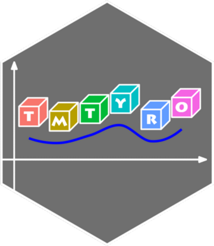

<!-- README.md is generated from README.Rmd. Please edit that file -->

```{r, include = FALSE}
knitr::opts_chunk$set(
  collapse = TRUE,
  comment = "#>",
  fig.path = "man/figures/README-",
  out.width = "100%"
)
```

# tmtyro <a href="https://jmclawson.github.io/tmtyro/"></a>

<!-- badges: start -->
<!-- badges: end -->

tmtyro is designed to help beginners work with and analyze text for simple and complex features. Adopting tidytext principles, tmtyro abstracts processes a few levels further to allow tyros apply text mining techniques before they're deeply familiar with R code. 

## Installation

You can install the development version of tmtyro from [GitHub](https://github.com/) with:

``` r
# install.packages("remotes")
remotes::install_github("jmclawson/tmtyro")
```

## Example

One of the first steps of any text mining workflow is to load a corpus of texts from a directory. While doing so, it may be desirable to detect paragraph breaks and prepare a data frame with one word per row. The `load_texts()` function makes this easy.

```{r example, echo=TRUE, eval=FALSE}
library(tmtyro)
mysteries <- load_texts("mycorpus")
```

