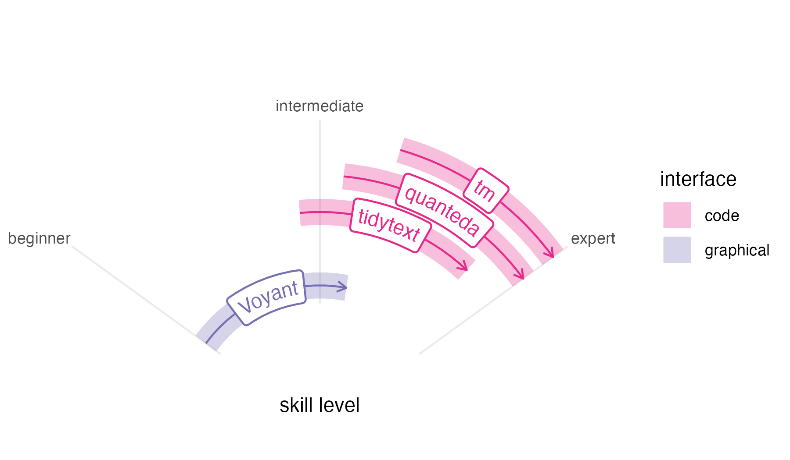
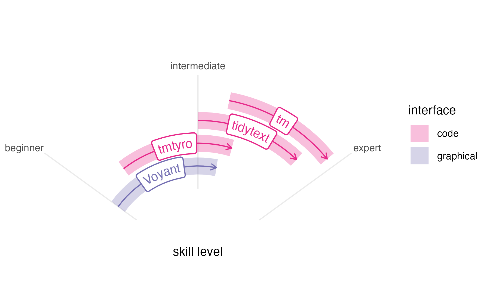

# Differentiating tmtyro

This package does not exist in a vaccuum. Wonderful text mining tools
already exist for digital humanities classrooms and researchers working
with text data, including the online tool
[Voyant](https://voyant-tools.org), which is both powerful and easy to
use for beginners; the
[tidytext](https://juliasilge.github.io/tidytext/) package in R,
designed to work with the popular
[tidyverse](https://tidyverse.tidyverse.org) package suite; the
[quanteda](https://quanteda.io/index.html) package in R, with many
options offering precision and power; and the
[tm](https://tm.r-forge.r-project.org) package in R, a long-standing
tool used by specialists. Their designs situate them for different
audiences and purposes. Similarly, the tmtyro package is designed with a
particular audience and purpose in mind.

## In context



Voyant is one of the best-known tools for working with text data in the
humanities. Begun in development by Stéfan Sinclair and Geoffrey
Rockwell over more than twenty years ago, it has become a standard—and
with good reason. Its graphical interface makes it accessible to novices
without compromising ability or features. Still, Voyant’s easy-to-use
interface ultimately limits users’ growth, since that same interface can
keep Voyant from serving as a [skills
ramp](https://jmclawson.github.io/tmtyro/articles/03-skills-ramp.md) to
other options.

Unlike Voyant, code-based methods for working with text offer both
reproducibility and open-ended tooling. In R, the tm package created by
Ingo Feinerer and Kurt Hornik is among the oldest and most widely used
packages for text mining.[¹](#fn1) It emphasizes corpus creation and
choosing text features for study. First published on CRAN in 2007, it
predates the other packages described here by almost a decade, and its
data design—emphasizing document-term matrices or DTMs (sometimes called
document-feature matrices or DFMs)—makes it sometimes hard to work with
common workflows.

The quanteda package, released by Kenneth Benoit in 2015, is in
continual development, and it probably offers the most robust feature
set of any in this list. It provides workflows for corpus creation,
choosing features, searching words in context, working with custom
dictionaries, and visualizing results, among other things, providing
helpful documentation along the way. For a beginner, its abundance of
options and multiple-step workflows can be overwhelming. And like tm,
quanteda’s primary data design is not ideally suited for popular
packages like dplyr.[²](#fn2) Nevertheless, quanteda provides power and
specialized functionality that merit its learning curve.

The newest of these options is tidytext, created by Julia Silge and
David Robinson in 2019. Unlike tm and quanteda, tidytext is made using a
“tidy” design philosophy that is consistent with many popular R
packages.[³](#fn3) Additionally, a companion book, [*Text Mining with
R*](https://www.tidytextmining.com), offers impressive documentation,
easing the learning curve for anyone new to text mining. But this book’s
preface acknowledges a starting point quite a ways above zero, expecting
that “the reader is at least slightly familiar with dplyr, ggplot2, and
the %\>% ‘pipe’ operator in R.” These expectations make tidytext tough
for complete beginners who must get up to speed with other tools before
using it.



In this context, the tmtyro package steps cautiously into the remaining
space to fill a particular need. Developed while teaching two semesters
of an undergraduate course on literary text mining, it grew from a
folder of “helper” functions written for students. Our course was taught
in the English department, and it was never meant to be a “coding class”
so much as one that induced students to think about text in new ways.
The syllabus followed through examples from *Text Mining in R* and,
ambitiously, *Text Analysis with R for Students of Literature*, by
Matthew Jockers and Rosamond Thalken, pairing methods with applications
in recent research. Each week, students applied techniques to ask their
own questions about their own selections of writing. Having working
tools in front of us helped everyone test the boundaries of this new
world and map how we might follow similar paths to those laid out in the
readings.

Like Voyant, tmtyro is designed for a beginner, and it strives for
predictability. Workflows are provided for loading texts from a folder
or for getting a corpus of texts from online collections. Once texts are
loaded, repetitive conventions for function names make it easy to add
columns for analysis in a single step, and generic functions handle
details of tables and figures.

Most importantly, tmtyro provides a skills ramp for users who outgrow
it. Code workflows are designed to help beginners move quickly at the
start to try things out. From there, a student who gains confidence in
the methods provided by the package might step beyond it to tweak a
visualization using functions from ggplot2. A researcher wishing to work
with a subset of titles will begin to understand methods from dplyr. And
since tmtyro’s data design is based on that of tidytext, a user can
transition between both packages seamlessly, using them together. Nobody
is expected to stick with tmtyro forever, but functions are designed to
remain useful long past the “tyro” stage.

## In code

Because each of these packages was developed for different audiences,
they take different approaches to common steps. The functions and
approaches used by tmtyro seem most similar to those of tidytext. At the
same time, many details or choices are hidden to simplify the interface
and prioritize getting results.

The code to use each package is shown below for comparison. Every
approach assumes the same object definition showing the path to a folder
of text files:

``` r
text_directory <- "path/to/files"
```

It is likely that someone more familiar with a given package would take
a different approach, but these examples demonstrate the method someone
might try after searching documentation and the internet. When methods
are benchmarked, some might be faster than others, but speeds feel
comparable in testing.

### Load texts from a folder

This first comparison shows a first step of loading a corpus from a
local folder of texts.

- tmtyro
- tidytext
- quanteda
- tm

``` r
library(tmtyro)

my_corpus <- load_texts(text_directory)
```

Behind the scenes, tmtyro’s
[`load_texts()`](https://jmclawson.github.io/tmtyro/reference/load_texts.md)
uses functions from base R and a number of packages: dplyr, forcats,
purrr, rlang, stringr, tibble, tidyr, and tidytext. When lemmatizing or
tagging parts of speech, it also uses textstem, openNLP, and NLP.

``` r
library(tidytext)
library(dplyr)
library(readr)
library(stringr)

my_corpus_tt <- 
  data.frame(
    doc_id = list.files(text_directory, "\\.txt$")) |> 
  mutate(
    text = paste(text_directory, doc_id, sep = "/") |> 
      read_file(),
    .by = doc_id) |> 
  mutate(
    doc_id = str_remove_all(doc_id, "[.]txt")) |> 
  unnest_tokens(word, text)
```

``` r
library(quanteda)
library(readtext)

my_corpus_qu <- 
  readtext(
    paste0(text_directory, "/*.txt"),
    docvarsfrom = "filenames") |> 
  corpus() |> 
  tokens()
```

``` r
library(tm)

my_corpus_tm <- DirSource(text_directory) |> 
  Corpus(readerControl = list(reader = readPlain))
```

### Remove stop words

Removing stop words is a common step in text analysis. Each of these
examples continues directly from the previous step of loading texts.

- tmtyro
- tidytext
- quanteda
- tm

``` r
sans_stopwords <- drop_stopwords(my_corpus)
```

[`drop_stopwords()`](https://jmclawson.github.io/tmtyro/reference/drop_stopwords.md)
uses functions from dplyr and tidytext.

``` r
sans_stopwords_tt <- anti_join(my_corpus_tt, get_stopwords())
```

``` r
library(stopwords)

sans_stopwords_qu <- tokens_remove(my_corpus_qu, stopwords("english"))
```

``` r
sans_stopwords_tm <-  
  tm_map(my_corpus_tm,
         removeWords, 
         stopwords("english"))
```

### Add sentiment

A pre-trained lexicon is needed to tag texts for sentiment. The process
differs for each package.

- tmtyro
- tidytext
- quanteda
- tm

``` r
sentiment <- add_sentiment(my_corpus)
```

[`add_sentiment()`](https://jmclawson.github.io/tmtyro/reference/add_sentiment.md)
uses functions from rlang, dplyr, textdata, and tidytext.

``` r
sentiment_tt <- inner_join(my_corpus_tt, get_sentiments())
```

``` r
sentiment_qu <- 
  tokens_lookup(
    my_corpus_qu,
    dictionary = data_dictionary_LSD2015, 
    exclusive = FALSE)
```

``` r
library(syuzhet)

sentiment_tm <- get_sentiment(my_corpus_tm)

# This doesn't actually do the job. I'm not sure what the equivalent would be using tm.
```

### Measure Tf-idf

Term frequency–inverse document frequency is a method for weighing words
by their contribution to distinctness within a corpus.

- tmtyro
- tidytext
- quanteda
- tm

``` r
tfidf <- summarize_tf_idf(my_corpus)
```

[`summarize_tf_idf()`](https://jmclawson.github.io/tmtyro/reference/summarize_tf_idf.md)
uses functions from dplyr and tidytext.

``` r
tfidf_tt <- my_corpus_tt |>
 count(doc_id, word, sort = TRUE)

total_words <- tfidf_tt |> 
  group_by(doc_id) |> 
  summarize(total = sum(n))

tfidf_tt <- left_join(tfidf_tt, total_words) |> 
  bind_tf_idf(word, doc_id, n)
```

``` r
tfidf_qu <- dfm(my_corpus_qu) |> 
  docfreq(scheme = "inverse")
```

``` r
tfidf_tm <- weightTfIdf(DocumentTermMatrix(my_corpus_tm))
```

### Visualize most frequent words

Measuring word frequency is a basic step for text mining. Well-prepared
figures can help communicate results.

- tmtyro
- tidytext
- quanteda
- tm

``` r
my_corpus |> 
  add_frequency()
  visualize()
```

For showing word counts,
[`visualize()`](https://jmclawson.github.io/tmtyro/reference/visualize.md)
uses ggplot2. Other kinds of visualizations will add the forcats,
scales, tidyr, ggraph, and igraph packages.

``` r
library(ggplot2)

my_corpus_tt |> 
  count(word, sort = TRUE) |> 
  slice_head(n = 10) |> 
  mutate(proportion = n / sum(n)) |> 
  ggplot(aes(proportion, reorder(word, proportion))) +
  geom_col() +
  labs(y = NULL)
```

``` r
library(quanteda.textstats)
library(ggplot2)

tokens(my_corpus_qu,
       remove_punct = TRUE) |> 
  dfm() |> 
  textstat_frequency(n = 10) |> 
  ggplot(aes(x = frequency,
             y = reorder(feature, -rank))) +
  geom_col() + 
  labs(y = NULL)
```

``` r
library(Rgraphviz)

plot(TermDocumentMatrix(my_corpus_tm),
     terms = findFreqTerms(TermDocumentMatrix(my_corpus_tm))[1:10])

# This doesn't actually work, since the necessary package was removed from CRAN.
```

### Complete workflow

This last section compares four packages for walking through a common
workflow, using each to load a folder of texts, remove stopwords, and
visualize most frequent words.

- tmtyro
- tidytext
- quanteda
- tm

``` r
library(tmtyro)

load_texts(text_directory) |> 
  drop_stopwords() |> 
  add_frequency() |> 
  visualize()
```

``` r
library(tidytext)
library(dplyr)
library(tibble)
library(ggplot2)
data(stop_words)

data.frame(
    doc_id = list.files(text_directory, "\\.txt$")) |> 
  mutate(
    text = paste(text_directory, doc_id, sep = "/") |> 
      read_file(),
    .by = doc_id) |> 
  unnest_tokens(word, text) |> 
  anti_join(stop_words) |> 
  count(word, sort = TRUE) |> 
  slice_head(n = 10) |> 
  mutate(proportion = n / sum(n)) |> 
  ggplot(aes(proportion, reorder(word, proportion))) +
  geom_col() +
  labs(y = NULL)
```

``` r
library(quanteda)
library(readtext)
library(stopwords)
library(ggplot2)

readtext(
    paste0(text_directory, "/*.txt"),
    docvarsfrom = "filenames") |> 
  corpus() |> 
  tokens(remove_punct = TRUE) |> 
  tokens_remove(stopwords("english")) |> 
  dfm() |> 
  textstat_frequency(n = 10) |> 
  ggplot(aes(x = frequency,
             y = reorder(feature, -rank))) +
  geom_col() + 
  labs(y = NULL)
```

``` r
library(tm)
library(Rgraphviz)

Corpus(
  DirSource(text_directory), 
  readerControl = list(reader = readPlain)) |> 
  tm_map(removeWords, 
         stopwords("english")) |> 
  TermDocumentMatrix() |> 
  plot(terms = findFreqTerms(TermDocumentMatrix(my_corpus_tm))[1:10])

# This doesn't actually work, since the necessary package was removed from CRAN.
```

## References

Benoit, Kenneth, et al. “quanteda: An R Package for the Quantitative
Analysis of Textual Data.” *Journal of Open Source Software*, vol. 3,
no. 30, 2018, p. 774, <https://doi.org/10.21105/joss.00774>.

Feinerer, Ingo, and Kurt Hornik. *tm: Text Mining Package*. 2024,
<https://CRAN.R-project.org/package=tm>.

Jockers, Matthew L., and Rosamond Thalken. *Text Analysis with R for
Students of Literature*. Springer, 2020.

*Michigan Corpus of Upper-Level Student Papers*. The Regents of the
University of Michigan, 2009, <https://elicorpora.info/main>.

*Project Gutenberg*. [www.gutenberg.org](https://www.gutenberg.org).

Silge, Julia, and David Robinson. *Text Mining with R: A Tidy Approach*.
O’Reilly Media, Inc., 2017, <https://www.tidytextmining.com>.

---. “tidytext: Text Mining and Analysis Using Tidy Data Principles in
R.” *JOSS*, vol. 1, no. 3, 2016, <https://doi.org/10.21105/joss.00037>.

Sinclair, Stéfan, and Geoffrey Rockwell. *Voyant Tools*. 2016,
<http://voyant-tools.org/>.

Wickham, Hadley, et al. “Welcome to the tidyverse.” *Journal of Open
Source Software*, vol. 4, no. 43, 2019, p. 1686,
<https://doi.org/10.21105/joss.01686>.

------------------------------------------------------------------------

1.  Among the three packages discussed here, tm shows the most downloads
    from CRAN, with more than 57 thousand downloads last month, compared
    to 44 thousand for tidytext and 37 thousand for quanteda.

2.  For comparison, dplyr’s monthly download numbers typically rival
    quanteda’s lifetime downloads. And although an experimental package
    *quanteda.tidy* was started to make quanteda work more consistently
    with dplyr and other packages in the tidyverse family, it seems no
    longer in development.

3.  This design might account for its higher download rate when compared
    to the more powerful quanteda.
