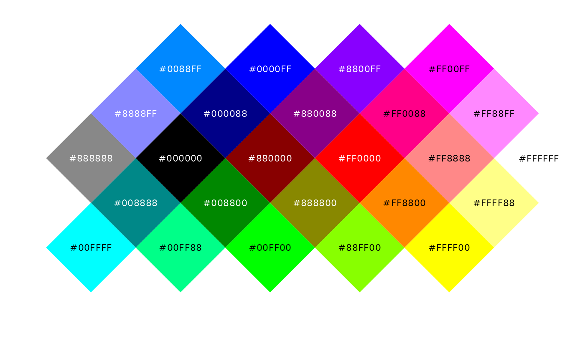
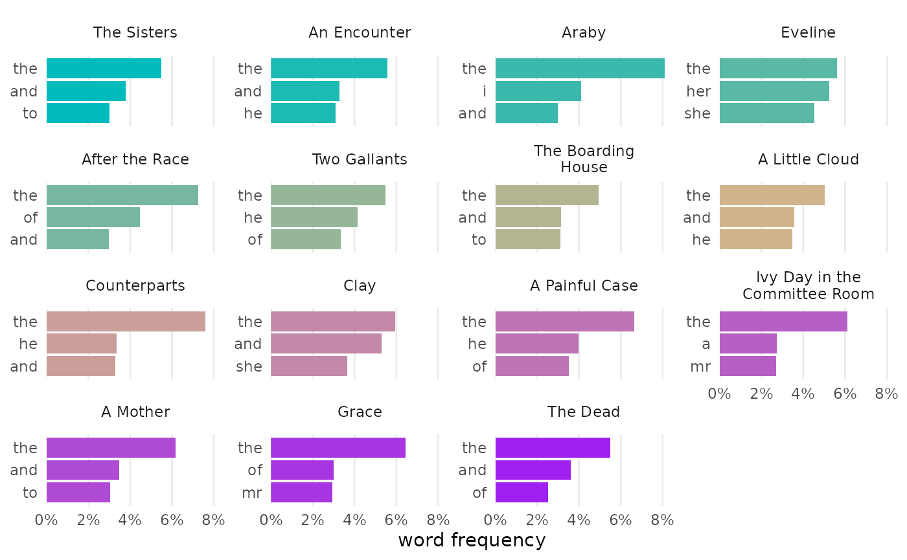
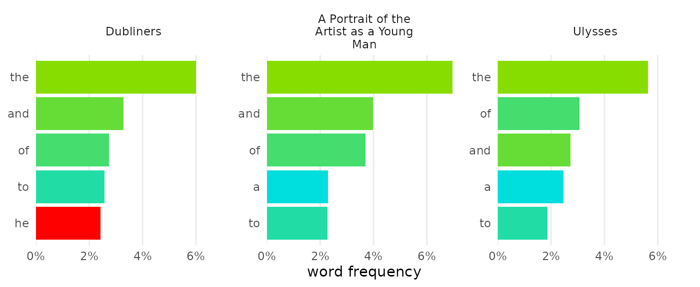
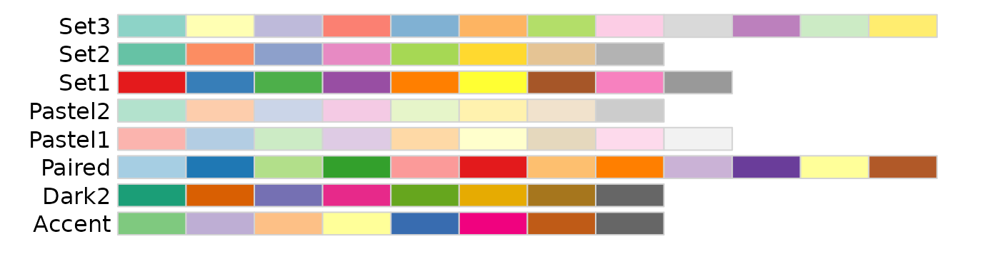
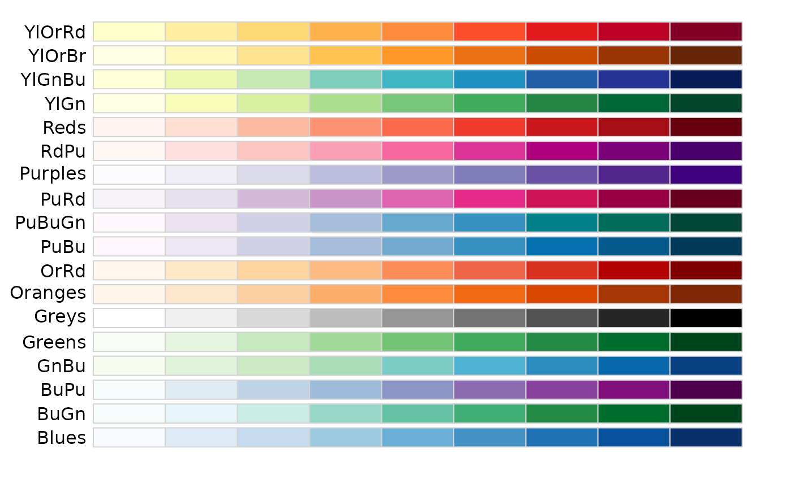
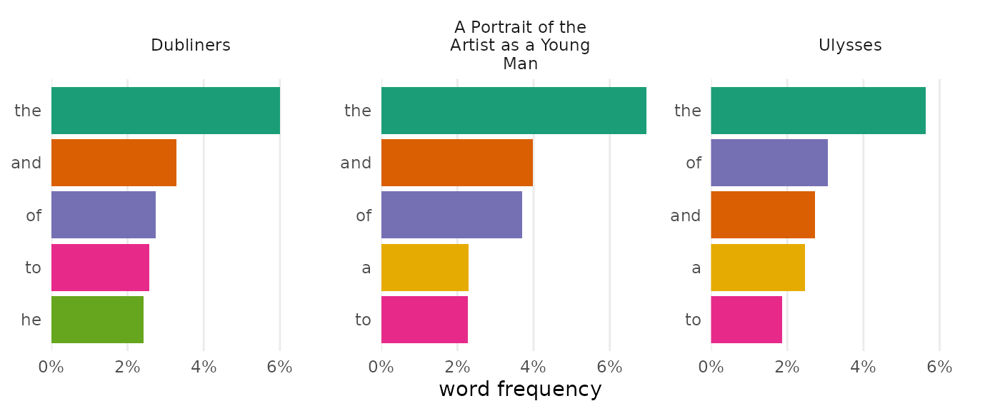
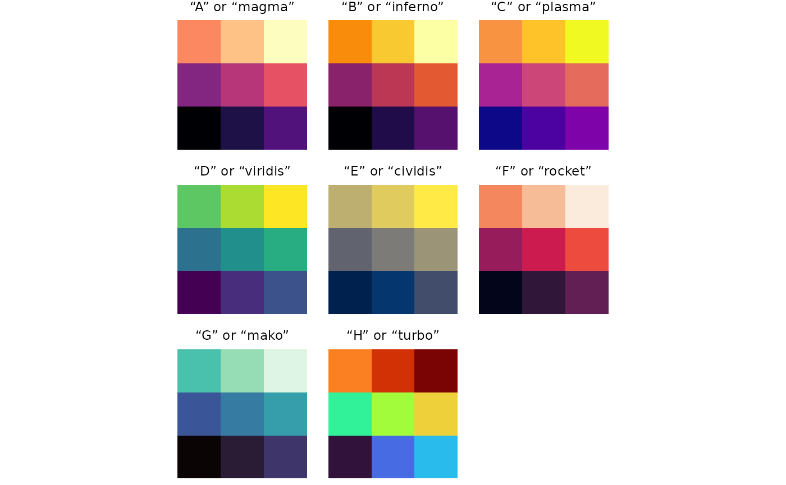
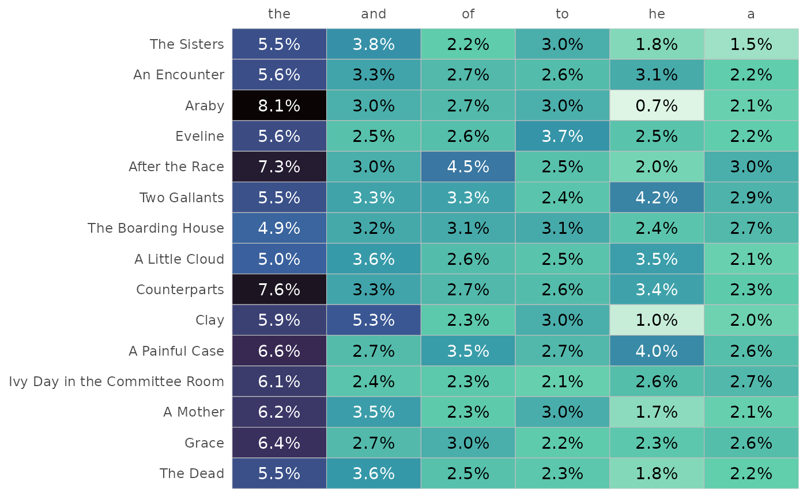

# Customizing colors

Not everyone has experience coding, but everyone has a favorite color.
To help beginners feel a sense of ownership for the work they do, tmtyro
simplifies color customization using a single function:
[`change_colors()`](https://jmclawson.github.io/tmtyro/reference/change_colors.md).
It takes the place of twelve different scaling functions from ggplot2
while providing a standard interface for any visualization created by
tmtyro.

## Colors are tricky

ggplot2 can set color in many different ways, but only one way will work
for any given scenario. Clearest is the distinction between *color* and
*fill*. The first applies color to points, lines, and edges. It’s
adjusted with functions that have *color* in their names, like
[`scale_color_manual()`](https://ggplot2.tidyverse.org/reference/scale_manual.html).
The *fill* aesthetic, on the other hand, defines areas, inside shapes,
and in bars. It’s adjusted with functions that have *fill* in their
names, like
[`scale_fill_manual()`](https://ggplot2.tidyverse.org/reference/scale_manual.html).
In every case, the **`_fill_`** or **`_color_`** part of a function will
indicate its target.

Difficulty grows from there. Colors and fills are set in different ways
for discrete data, continuous data, and binned data. Worse, color
palettes are chosen using three incompatible methods depending on color
set, with one method for custom manual palettes, another method for
Brewer palettes, and a third for Viridis palettes. Many other options
are available through additional packages, but this combination of two
aesthetics, three types of data, and three types of palettes are built
in to ggplot2.

[TABLE]

This table shows half of the 18 commonest functions for changing colors,
but ggplot2 offers 44 without counting spelling variants. And each row
of functions uses different parameters for choosing colors. The path to
color customization is steep.

## `change_colors()` is easy

All visualization functions from tmtyro can be changed from one standard
method:
[`change_colors()`](https://jmclawson.github.io/tmtyro/reference/change_colors.md).
This function considers a figure, figures out whether it makes more
sense to change *color* or *fill*, and applies a standard interface for
manual palettes, Brewer palettes, and Viridis palettes.

[`change_colors()`](https://jmclawson.github.io/tmtyro/reference/change_colors.md)
manages differentiation among data types.

- [`scale_color_manual()`](https://ggplot2.tidyverse.org/reference/scale_manual.html)
  works only for discrete data, and
  [`scale_color_gradient()`](https://ggplot2.tidyverse.org/reference/scale_gradient.html)
  is only good with continuous values.
- [`scale_color_brewer()`](https://ggplot2.tidyverse.org/reference/scale_brewer.html)
  will only work for discrete data types, while
  [`scale_color_distiller()`](https://ggplot2.tidyverse.org/reference/scale_brewer.html)
  works only for continuous data
- [`scale_color_viridis_d()`](https://ggplot2.tidyverse.org/reference/scale_viridis.html)
  will only work for discrete data types, while
  [`scale_color_viridis_c()`](https://ggplot2.tidyverse.org/reference/scale_viridis.html)
  will only work for continous data.
- **[`change_colors()`](https://jmclawson.github.io/tmtyro/reference/change_colors.md)
  accommodates discrete and continuous data**

[`change_colors()`](https://jmclawson.github.io/tmtyro/reference/change_colors.md)
also introduces one standard interface of arguments.

- [`scale_color_manual()`](https://ggplot2.tidyverse.org/reference/scale_manual.html)
  sets colors using named or hexadecimal colors in the `values` argument
- [`scale_color_brewer()`](https://ggplot2.tidyverse.org/reference/scale_brewer.html)
  sets colors using numbers or names with the `palette` argument
- [`scale_color_viridis_d()`](https://ggplot2.tidyverse.org/reference/scale_viridis.html)
  sets colors using letters with the `option` argument
- **[`change_colors()`](https://jmclawson.github.io/tmtyro/reference/change_colors.md)
  uses the `palettes` argument for everything**

When code is easy, the only difficult part is choice.

## Options are many

### manual colors

Most simply,
[`change_colors()`](https://jmclawson.github.io/tmtyro/reference/change_colors.md)
will set the colors you choose. Setting four colors for four items will
assign them directly; any other number will make a gradient.

Color names like “pink” and “orange” work in R, as do specific hues like
“forestgreen” and “steelblue.”[¹](#fn1) In addition to named colors, R
will accept colors as “hex codes” using hexadecimal notation.[²](#fn2)
The first two digits of a hex code describe how *red* a color is from 0
to 255; the middle two describe how *green* it is; and the last two
describe how *blue*. Combinations in the following chart give a sense of
how they work, but an [online color
picker](https://www.w3schools.com/colors/colors_picker.asp) may help to
narrow things down.[³](#fn3)



Use manual colors—as named colors or as hex codes—by combining them in a
vector inside
[`change_colors()`](https://jmclawson.github.io/tmtyro/reference/change_colors.md):

``` r
dubliners_count |> 
  change_colors(c("#00BBBB", "tan", "purple"))
```



Custom colors also work well when naming particular values:

``` r
joyce_count |> 
  change_colors(c(
    "#88DD00", "#00DDDD",
    he = "red"))
```



### Brewer palettes

If you’d rather not pick colors manually, [Brewer
palettes](https://colorbrewer2.org) are an excellent choice. The Brewer
qualitative palettes are well suited for discrete data, using color to
distinguish categories like documents or words.



Brewer’s sequential palettes are ideal for showing differences in
magnitude:



Choose a Brewer palette by using its name or number in the `palette`
argument:

``` r
joyce_count |> 
  change_colors("Brewer", palette = "Dark2")
```



### Viridis palettes

Viridis palettes offer another set of choices for colors in your
visualizations. These palettes not only look beautiful on the screen,
but they typically work well for monochrome print and are designed to
accommodate most color vision needs.

These palettes work especially well for continuous data. Option “H” or
“turbo” could work for discrete scales, but it also has a few caveats:
among them, it’s poorly suited for black and white printing since it
maps *high* to *low* along a circular path, from *dark* to *light* to
*dark*.



Choose a Viridis palette by using its name or letter in the `palette`
argument:

``` r
dubliners |> 
  expand_documents() |> 
  visualize(digits = 1) |> 
  change_colors("Viridis", palette = "mako")
```



------------------------------------------------------------------------

1.  The full list of named colors can be viewed in the [“Colors in R”
    cheat sheet](http://www.stat.columbia.edu/~tzheng/files/Rcolor.pdf).

2.  Unlike decimal notation, which uses 10 digits, hexadecimal notation
    uses 16. The first ten digits run 0 through 9, and the remaining six
    digits go from A to F, with A representing 10, B representing 11,
    and so on.

3.  If you’re more comfortable thinking in percentages,
    [`rgb()`](https://rdrr.io/r/grDevices/rgb.html) will be useful.
    Feeding this function three arguments will return the corresponding
    hex code: `rgb(red = 0.60, green = 0.00, blue = 1.00)` returns
    “#9900FF”.
