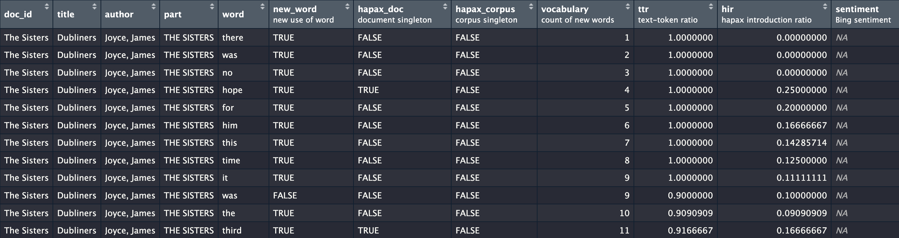

# Labels and Logging

Because sometimes we all get confused, tmtyro tries to keep things
clear. In addition to using simple function names, tmtyro adds
descriptive labels to variables explaining what they mean. It also logs
steps in a workflow and offers tools to turn these built-in logs into a
descriptive narrative.

## Labels

In RStudio and Positron, variable labels show up in the data viewer.
Standard tmtyro functions that add columns—like
[`add_vocabulary()`](https://jmclawson.github.io/tmtyro/reference/add_vocabulary.md)
or
[`add_sentiment()`](https://jmclawson.github.io/tmtyro/reference/add_sentiment.md)—prepare
reasonable default labels in English.

``` r
library(tmtyro)
corpus_dubliners <- get_gutenberg_corpus(2814) |> 
  load_texts() |> 
  identify_by(part) |> 
  standardize_titles() |> 
  add_vocabulary() |> 
  add_sentiment()
```

These labels show in the IDE’s data viewer:



They’re also revealed in the data dictionary made with
[`get_data_dictionary()`](https://jmclawson.github.io/tmtyro/reference/get_data_dictionary.md):

``` r
get_data_dictionary(corpus_dubliners)
#>        variable                    label     class
#> 1        doc_id                     <NA>    factor
#> 2         title                     <NA> character
#> 3        author                     <NA> character
#> 4          part                     <NA> character
#> 5          word                     <NA> character
#> 6      new_word          new use of word   logical
#> 7     hapax_doc       document singleton   logical
#> 8  hapax_corpus         corpus singleton   logical
#> 9    vocabulary       count of new words   integer
#> 10          ttr         text-token ratio   numeric
#> 11          hir hapax introduction ratio   numeric
#> 12    sentiment           Bing sentiment character
```

Column labels can be easily modified with
[`set_data_dictionary()`](https://jmclawson.github.io/tmtyro/reference/set_data_dictionary.md):

``` r
dubliners_dd <- data.frame(
  variable = "doc_id",
  label = "story title"
)

corpus_dubliners <- corpus_dubliners |> 
  set_data_dictionary(dubliners_dd)

get_data_dictionary(corpus_dubliners, only_labeled = TRUE)
#>        variable                    label     class
#> 1        doc_id              story title    factor
#> 6      new_word          new use of word   logical
#> 7     hapax_doc       document singleton   logical
#> 8  hapax_corpus         corpus singleton   logical
#> 9    vocabulary       count of new words   integer
#> 10          ttr         text-token ratio   numeric
#> 11          hir hapax introduction ratio   numeric
#> 12    sentiment           Bing sentiment character
```

### Off-label use

There are many ways to opt out of labels.

1.  Setting the environment variable `TMTYRO_USE_LABELS` to `FALSE`—for
    example, either with the session-persistent command
    `Sys.setenv(TMTYRO_USE_LABELS = FALSE)` or by editing your
    `.Renviron`—will do the trick as long as the variable is defined.
2.  Within a document or session, `options(tmtyro.use_labels = FALSE)`
    will also disable them.
3.  Functions adding columns also provide an argument to toggle labels
    for these columns. For instance, `add_sentiment(label = FALSE)` will
    avoid labeling the `sentiment` column.

Labels can also be removed with
[`drop_labels()`](https://jmclawson.github.io/tmtyro/reference/drop_labels.md).

## Logging

As tmtyro’s functions apply new transformations to a corpus, they also
record a reproducible log of what they did. This log is made accessible
to readers with the
[`narrativize()`](https://jmclawson.github.io/tmtyro/reference/narrativize.md)
function, which explains the decisions made:

``` r
corpus_joyce <- get_gutenberg_corpus(c(2814, 4217, 4300)) |> 
  load_texts() |> 
  identify_by(title) |> 
  add_vocabulary()

narrativize(corpus_joyce)
#>  - Retrieved a corpus from Project Gutenberg using ID numbers 2814, 4217, and 4300.
#>  - Loaded texts by tokenizing words, converting to lowercase, and preserving paragraph breaks.
#>  - Identified documents using the column `title`.
#>  - Measured cumulative uniqueness of words in each document.
```

This output would ideally be adjusted before it is shared, but the
function can already be adjusted for perspective and format:

``` r
narrativize(corpus_joyce, person = "I", format = "text")
#> First I retrieved a corpus from Project Gutenberg using ID numbers 2814, 4217, and 4300. Then I loaded texts by tokenizing words, converting to lowercase, and preserving paragraph breaks. Next, I identified documents using the column `title`. Finally, I measured cumulative uniqueness of words in each document.
```

### Custom dictionaries

A reasonable `narrative_dictionary_en` is provided for use with
[`narrativize()`](https://jmclawson.github.io/tmtyro/reference/narrativize.md)
by default. It can be used as a model to prepare alternative sentences
to follow a house style or to describe process in another language.

``` r
narrative_dictionary_fr <- tibble::tribble(
  ~fn, ~parameter, ~narrative, ~prefix, ~suffix, ~plural_pre, ~plural_suf,
  "get_gutenberg_corpus", NA, "Récupéré un corpus depuis Project Gutenberg à l'aide de {parameters}.", NA, NA, NA, NA, #
  "get_gutenberg_corpus", "gutenberg_id", NA, "numéro d'ID", NA, "numéros d'ID", NA,

  "load_texts", NA, "Préparé des textes{parameters}.", NA, NA, NA, NA, #
  "load_texts", "parameters", NA, "en", NA, NA, NA,
  "load_texts", "word", "tokenisant les mots", NA, NA, NA, NA,
  "load_texts", "to_lower", "convertissant en minuscules", NA, NA, NA, NA,
  "identify_by", NA, "Identifié les documents à l'aide de la {relevant_column}.", NA, NA, NA, NA, 
  "add_vocabulary", NA, "Calculé l'unicité des {feature}s au fil du temps.", NA, NA, NA, NA,
  NA, "and", "et", NA, NA, NA, NA,
  NA, "words", "mots", NA, NA, NA, NA,
  NA, "column", "colonne", NA, NA, NA, NA,
)

narrativize(corpus_joyce, dictionary = narrative_dictionary_fr)
#>  - Récupéré un corpus depuis Project Gutenberg à l'aide de numéros d'ID 2814, 4217, et 4300.
#>  - Préparé des textes en tokenisant les mots et convertissant en minuscules.
#>  - Identifié les documents à l'aide de la colonne `title`.
#>  - Calculé l'unicité des mots au fil du temps.
```

### Navigating log jams

Because tmtyro relies on a fixed set of functions to preserve and
prepare the log, using other functions can get things out of sync.

``` r
library(dplyr)
#> 
#> Attaching package: 'dplyr'
#> The following objects are masked from 'package:stats':
#> 
#>     filter, lag
#> The following objects are masked from 'package:base':
#> 
#>     intersect, setdiff, setequal, union
corpus_joyce2 <- corpus_joyce |> 
  group_by(doc_id) |> 
  mutate(total_words = n()) |> 
  ungroup() |> 
  add_tf_idf()

narrativize(corpus_joyce2)
#>  - Calculated TF-IDF values for each word across documents.
```

Get around these log jams with helper functions
[`get_methods_log()`](https://jmclawson.github.io/tmtyro/reference/methods_log.md),
[`set_methods_log()`](https://jmclawson.github.io/tmtyro/reference/methods_log.md),
and
[`add_methods_log()`](https://jmclawson.github.io/tmtyro/reference/methods_log.md):

``` r
joyce_log <- get_methods_log(corpus_joyce)

corpus_joyce2 <- corpus_joyce |> 
  group_by(doc_id) |> 
  mutate(total_words = n()) |> 
  ungroup() |> 
  set_methods_log(joyce_log) |> 
  add_methods_log("Counted the total words in each document.") |> 
  add_tf_idf()

corpus_joyce2 |> 
  narrativize()
#>  - Retrieved a corpus from Project Gutenberg using ID numbers 2814, 4217, and 4300.
#>  - Loaded texts by tokenizing words, converting to lowercase, and preserving paragraph breaks.
#>  - Identified documents using the column `title`.
#>  - Measured cumulative uniqueness of words in each document.
#>  - Counted the total words in each document.
#>  - Calculated TF-IDF values for each word across documents.
```

### Avoiding logging

These logs are optional and can be disabled with an environment variable
or per session:

1.  Setting the environment variable `TMTYRO_USE_LOG` to `FALSE`—for
    example, either with the session-persistent command
    `Sys.setenv(TMTYRO_USE_LOG = FALSE)` or by editing your
    `.Renviron`—will do the trick as long as the variable is defined.
2.  Within a document or session, `options(tmtyro.use_log = FALSE)` will
    also disable them.

An existing log can also be removed from an object `x` with
`x <- set_methods_log(x, NULL)`.
