# Customizing figures

Pictures paint thousands of words, so figures are necessary for
communicating complex ideas about texts. While tmtyro provides polished
figures with
[`visualize()`](https://jmclawson.github.io/tmtyro/reference/visualize.md),
there’s always room for refinement or reimagining.

## Customizing `visualize()`

The standard tmtyro functions like `add_frequencies()` prepare data that
can be plugged directly into
[`visualize()`](https://jmclawson.github.io/tmtyro/reference/visualize.md).
Figures prepared this way are clean and ready for use in reports and
presentations. Tweaking colors, themes, and labels can further tailor a
visualization to an specific project, preference, or purpose, either
using built-in features or exploring ggplot2 for greater flexibility.

### Colors

tmtyro’s
[`change_colors()`](https://jmclawson.github.io/tmtyro/reference/change_colors.md)
function combines six ggplot2 functions into a single function with a
single common interface.[¹](#fn1)

``` r
library(dplyr)
library(ggplot2)
library(tmtyro)

# Start by loading a corpus
corpus_dubliners <- get_gutenberg_corpus(2814) |> 
  load_texts() |> 
  identify_by(part) |> 
  standardize_titles()

# Choose a smaller subset of stories
select_titles <- unique(corpus_dubliners$doc_id)[c(1, 3, 12, 15)]

my_corpus <- corpus_dubliners |> 
  filter(doc_id %in% select_titles) |> 
  select(doc_id, word)
```

``` r
# standard output on left
word_freqs <- my_corpus |> 
  add_frequency() |> 
  visualize()

word_freqs

# custom colors on right
word_freqs |> 
  change_colors(palette = "Set1")
```

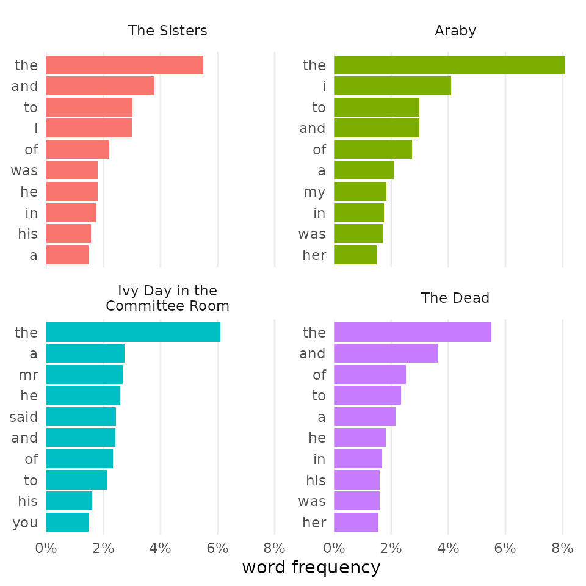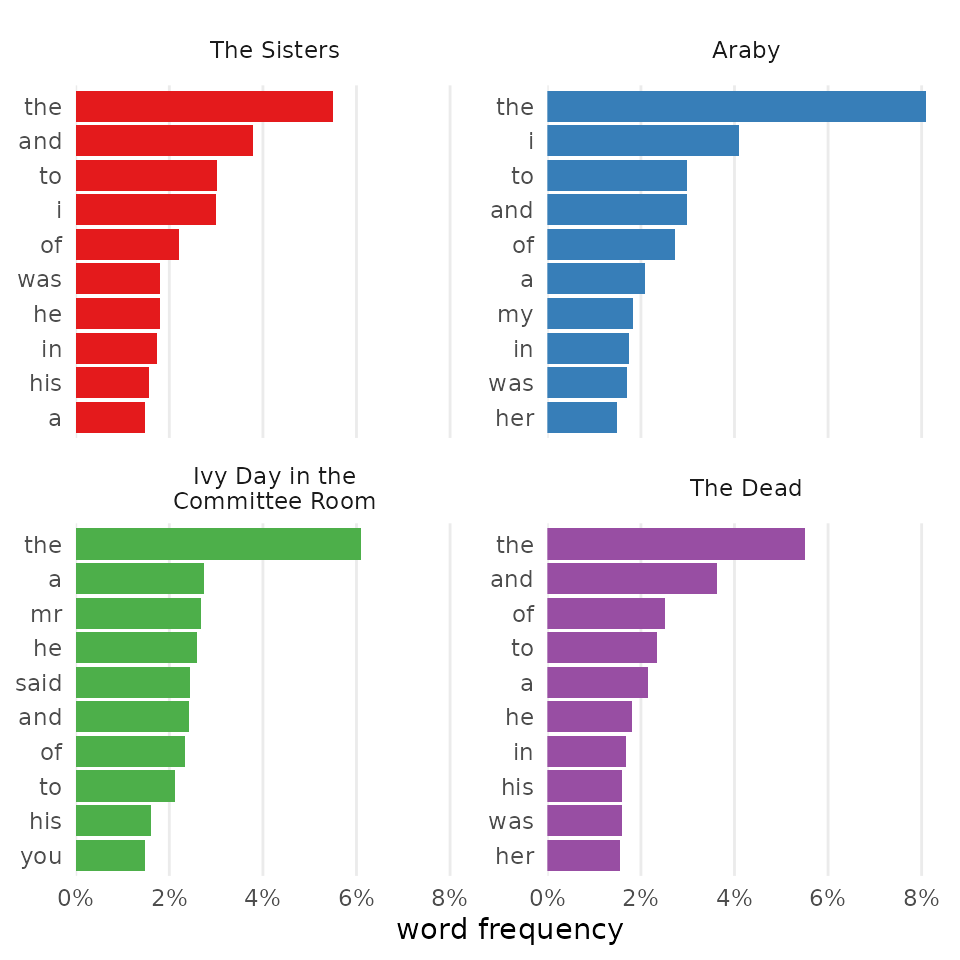

### Themes

Themes built into ggplot2 or offered by an extension package provide a
quick option for making figures more your own. Just remember to use the
plus operator (`+`) when chaining functions from ggplot2.

``` r
word_freqs +
  theme_classic()

word_freqs |> 
  change_colors(palette = "Pastel1") +
  theme_dark()
```

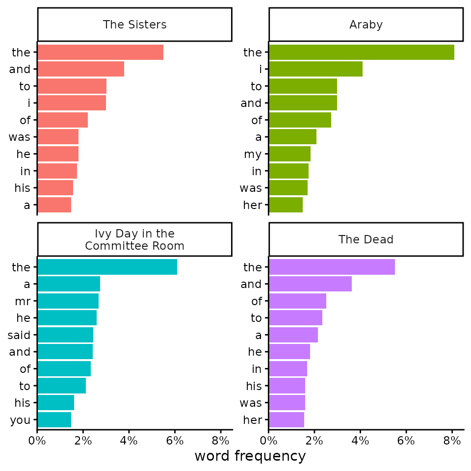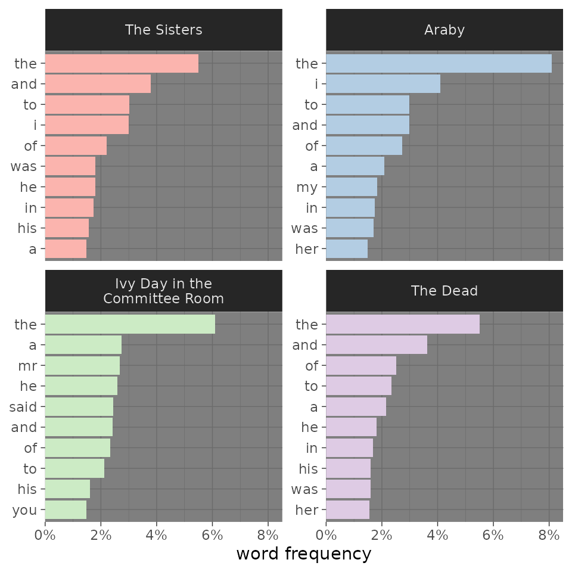

### Labels

Some figures make more sense with a title or different axis labels. The
[`labs()`](https://ggplot2.tidyverse.org/reference/labs.html) function
from ggplot2 makes it easy to adjust these.

``` r
my_corpus |> 
  add_frequency() |> 
  # Setting color_y is necessary when defining colors by Y values
  visualize(color_y = TRUE, reorder_y = TRUE) |> 
  change_colors(c(
    "said" = "goldenrod",
    "navy")) +
  labs(
    title = "Top Ten Words in Four Joyce Stories",
    subtitle = "The use of “said” in “Ivy Day” suggests more dialogue.",
    x = "prevalence",
    y = "word")
```

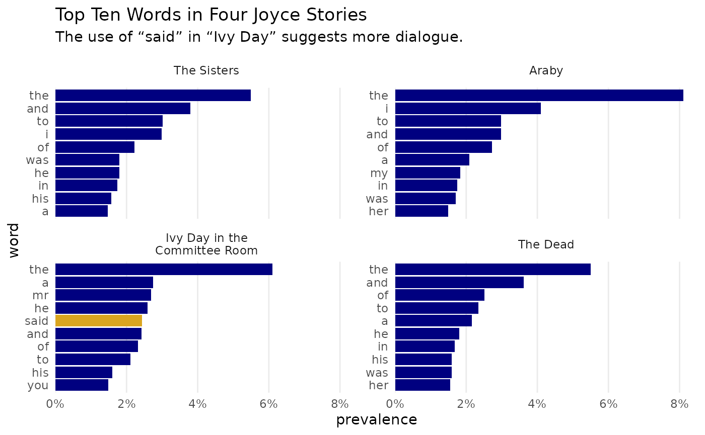

## Recreating `visualize()` figures

Vectorized functions beginning `get_...()` and `is...()` are not
directly compatible with
[`visualize()`](https://jmclawson.github.io/tmtyro/reference/visualize.md),
which is made for the standard workflow. But the visualizations they
support can be recreated with a bit of effort, and the techniques
learned in the process are transferable to other custom visualizations.
For further guidance and advanced techniques, the [ggplot2
documentation](https://ggplot2.tidyverse.org/articles/ggplot2.html)
offers much more than can be shown here.

### Corpus details

By default, a corpus prepared with
[`load_texts()`](https://jmclawson.github.io/tmtyro/reference/load_texts.md)
will
[`visualize()`](https://jmclawson.github.io/tmtyro/reference/visualize.md)
into a bar chart showing word counts for each document. Preparing
something manually is pretty simple, even if it doesn’t compare well to
the default output:

``` r
# default output on left
visualize(corpus_dubliners)

# manual output prepared with dplyr's count()
corpus_dubliners |> 
  count(doc_id) |> 
  ggplot(aes(
    x = n, 
    y = doc_id)) +
  geom_col()
```

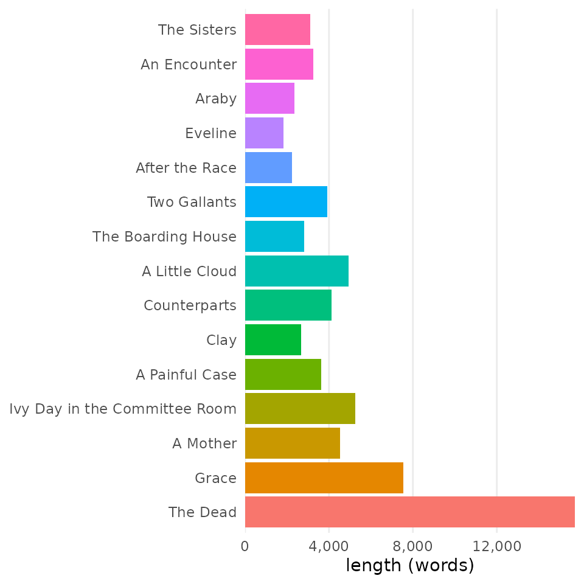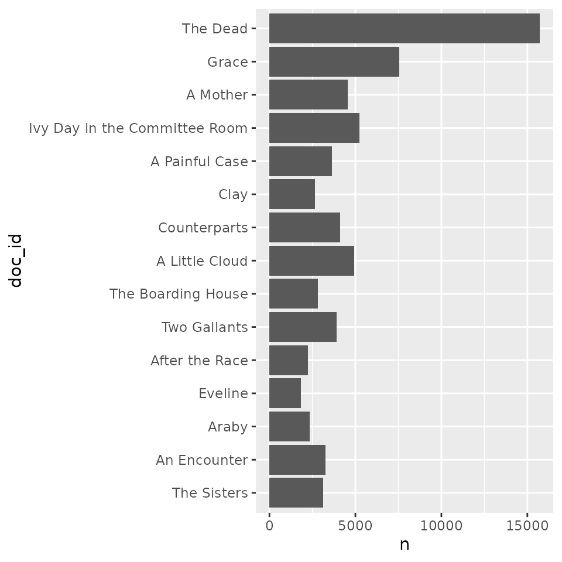

Among other things,
[`visualize()`](https://jmclawson.github.io/tmtyro/reference/visualize.md)
preserves the order of documents from top to bottom, adjusts labeling,
and adds some settings for theme and color. Alone, each is a simple
change. But everything adds up when polishing publication-ready graphs,
from gridlines to label spacing and number formatting:

``` r
corpus_dubliners |> 
  count(doc_id) |> 
  # reverse doc_id order
  mutate(doc_id = forcats::fct_rev(doc_id)) |> 
  ggplot(aes(
    x = n, 
    y = doc_id, 
    # add color
    fill = doc_id)) +
  geom_col(show.legend = FALSE) +
  # adjust number format and shift y-axis labels
  scale_x_continuous(
    labels = scales::label_comma(),
    expand = c(0, 0)) +
  # change the theme background
  theme_minimal() +
  # adjust labels
  labs(
    x = "length (words)",
    y = NULL) +
  # adjust grid lines
  theme(
    panel.grid.minor.x = element_blank(),
    panel.grid.major.y = element_blank(),
    panel.grid.minor.y = element_blank())
```

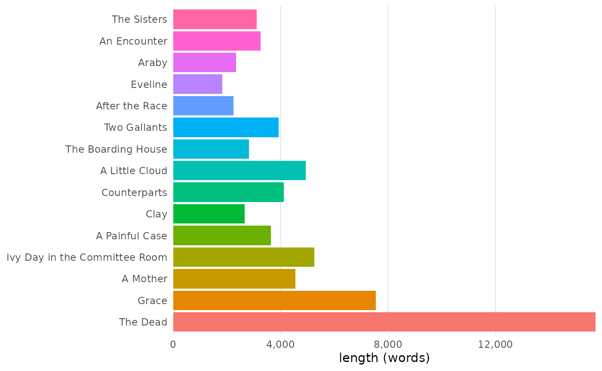

### Word frequencies

When used after
[`add_frequency()`](https://jmclawson.github.io/tmtyro/reference/add_frequency.md),
[`visualize()`](https://jmclawson.github.io/tmtyro/reference/visualize.md)
will prepare a faceted graph of some of the top word frequencies for
each document. To create something similar manually, using
[`mutate()`](https://dplyr.tidyverse.org/reference/mutate.html) with a
vectorized function like
[`get_frequency()`](https://jmclawson.github.io/tmtyro/reference/get_frequency.md)
or
[`get_tf_by()`](https://jmclawson.github.io/tmtyro/reference/get_tf_by.md),
it’s necessary to prepare a table with
[`distinct()`](https://dplyr.tidyverse.org/reference/distinct.html) and
[`slice_max()`](https://dplyr.tidyverse.org/reference/slice.html) before
piping it to
[`ggplot()`](https://ggplot2.tidyverse.org/reference/ggplot.html):

``` r
corpus_dubliners |>
  mutate(
    n = get_tf_by(word, doc_id)) |> 
  # dplyr's `distinct()` drops repeated rows
  distinct() |> 
  # dplyr's `slice_max()` takes the max n from each group
  slice_max(
    order_by = n, 
    by = doc_id, 
    n = 3) |> # show 3 words each
  ggplot(aes(
    x = n, 
    # `reorder_within()` reorders words for each facet
    y = tidytext::reorder_within(
      word, 
      by = n,
      within = doc_id))) +
  geom_col() +
  facet_wrap(vars(doc_id), scales = "free") +
  # `scale_y_reordered()` cleans up after `reorder_within()`
  tidytext::scale_y_reordered()
```

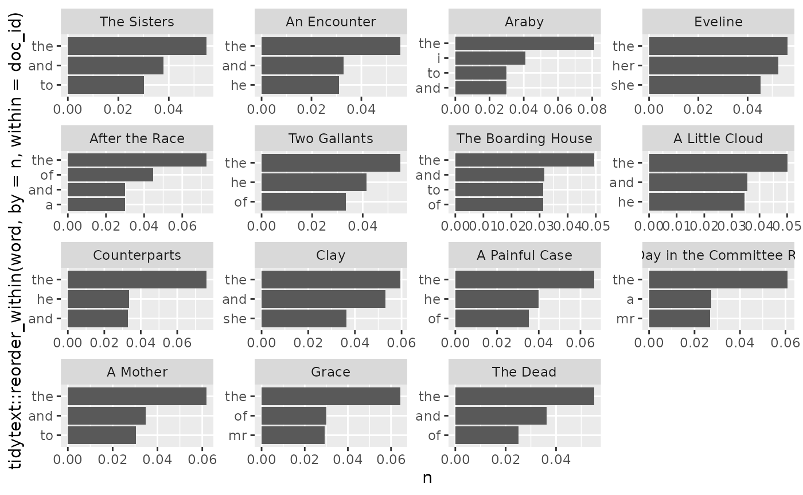

The resulting graph can be further customized with ggplot2’s standard
functions. After a function like
[`reorder_within()`](https://juliasilge.github.io/tidytext/reference/reorder_within.html),
the Y axis label especially needs some love.

### Vocabulary richness

Default visualizations from
[`add_vocabulary()`](https://jmclawson.github.io/tmtyro/reference/add_vocabulary.md)
are highly customized. It isn’t hard to make a simple version after a
vectorized function like
[`get_cumulative_vocabulary()`](https://jmclawson.github.io/tmtyro/reference/get_cumulative_vocabulary.md),
but this version can lack readability:

``` r
corpus_dubliners |> 
  group_by(doc_id) |> 
  mutate(
    vocab = get_cumulative_vocabulary(word), 
    progress = row_number()) |> 
  ungroup() |> 
  ggplot(aes(
    x = progress, 
    y = vocab, 
    color = doc_id)) +
  geom_line()
```

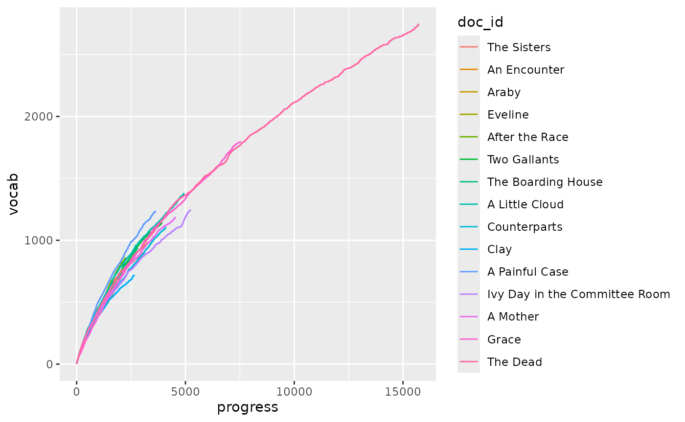

Adding direct labels is often worth the effort:

``` r
dubliners_vocab <- corpus_dubliners |> 
  group_by(doc_id) |> 
  mutate(
    vocab = get_cumulative_vocabulary(word), 
    progress = row_number()) |> 
  ungroup()

# Create a table of labels and locations
document_labels <- dubliners_vocab |> 
  group_by(doc_id) |> 
  summarize(
    vocab = last(vocab),
    progress = last(progress)) |> 
  ungroup()

dubliners_vocab |> 
  ggplot(aes(
    x = progress, 
    y = vocab, 
    color = doc_id)) +
  geom_line() +
  geom_point(
    data = document_labels) +
  # avoid overlapping labels
  ggrepel::geom_text_repel(
    data = document_labels,
    aes(label = doc_id)) +
  theme(legend.position = "none")
```

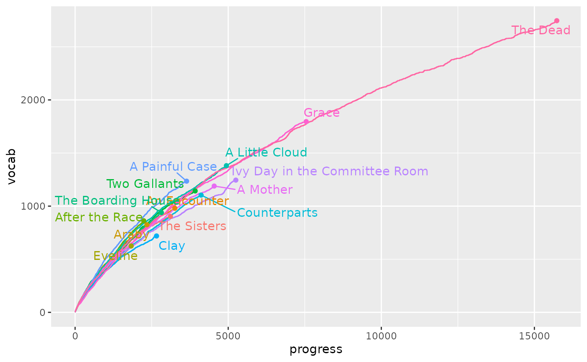

------------------------------------------------------------------------

1.  Read more on [“Changing
    colors”](https://jmclawson.github.io/tmtyro/articles/02-changing-colors.md).
