# Introduction to tmtyro

Working with text as data is a multi-step process. After choosing and
collecting documents, you’ll need to load them in some structured way
before anything else. Only then is it possible to “do” text analysis:
tagging parts of speech, normalizing by lemma, comparing features,
measuring sentiment, and so on. Even then, you’ll need to communicate
findings by preparing compelling explanations, tables, and
visualizations of your results.

The tmtyro package aims to make these steps fast and easy.

- Purpose-built functions for collecting a corpus let you focus on
  *what* instead of *how*.
- Scalable functions for loading a corpus provide room for growth, from
  simple word count to grammar parsing and lemmatizing.
- Additional functions standardize approaches for measuring word use and
  vocabulary uniqueness, detecting sentiment, assessing term
  frequency–inverse document frequency, working with n-grams, and even
  building topic models.
- One simple function prepares publication-ready tables, automatically
  adjusting based on the kind of data used. Another simple function
  prepares compelling visualizations, returning clean, publication-ready
  figures.
- When it’s time to share your work, a function prepares a narrative of
  the process that was automatically logged along the way.
- Every step is offered as a verb using complementary syntax. This keeps
  workflows easy to build, easy to understand, easy to explain, and easy
  to reproduce.

## Preparing texts

tmtyro offers a few functions to gather and load texts for study:

- [`get_gutenberg_corpus()`](https://jmclawson.github.io/tmtyro/reference/get_gutenberg_corpus.md)
  caches the HTML version of books by their Project Gutenberg ID, parses
  their text and headers, and presents them in a table.
- [`get_micusp_corpus()`](https://jmclawson.github.io/tmtyro/reference/get_micusp_corpus.md)
  caches papers from the Michigan Corpus of Upper-level Student Papers,
  parses them for metadata and contents, and presents them in a table.
- [`download_once()`](https://jmclawson.github.io/tmtyro/reference/download_once.md)
  caches an online file and passes the local path invisibly.
- [`load_texts()`](https://jmclawson.github.io/tmtyro/reference/load_texts.md)
  prepares a table in “tidytext” format with one word per row and
  columns for metadata. These texts can be loaded from a folder of files
  or passed from a table. Parameters allow for lemmatization,
  part-of-speech processing, and other options.

Other functions aid with preparing a corpus:

- [`move_header_to_text()`](https://jmclawson.github.io/tmtyro/reference/move_header_to_text.md)
  corrects overzealous identification of HTML headers when parsing books
  from Project Gutenberg.
- [`standardize_titles()`](https://jmclawson.github.io/tmtyro/reference/standardize_titles.md)
  converts a vector or column into title case, converts underscores with
  spaces, and optionally removes initial articles.
- [`identify_by()`](https://jmclawson.github.io/tmtyro/reference/identify_by.md)
  sets a column of metadata to serve as document marker.

### Get a corpus

Collecting texts from Project Gutenberg will be a common first step for
many. The function
[`get_gutenberg_corpus()`](https://jmclawson.github.io/tmtyro/reference/get_gutenberg_corpus.md)
needs only the Gutenberg ID number, found in the book’s URL. The
resulting table draws metadata from the gutenbergr package, with columns
for “gutenberg_id”, “title”, “author”, headers such as those used for
chapters, and “text.”

``` r
library(tmtyro)
joyce <- get_gutenberg_corpus(c(2814, 4217, 4300))

joyce
#> # A tibble: 10,810 × 7
#>    gutenberg_id title     author       part        section subsection text      
#>           <int> <chr>     <chr>        <chr>       <chr>   <chr>      <chr>     
#>  1         2814 Dubliners Joyce, James THE SISTERS NA      NA         There was…
#>  2         2814 Dubliners Joyce, James THE SISTERS NA      NA         Old Cotte…
#>  3         2814 Dubliners Joyce, James THE SISTERS NA      NA         “No, I wo…
#>  4         2814 Dubliners Joyce, James THE SISTERS NA      NA         He began …
#>  5         2814 Dubliners Joyce, James THE SISTERS NA      NA         “I have m…
#>  6         2814 Dubliners Joyce, James THE SISTERS NA      NA         He began …
#>  7         2814 Dubliners Joyce, James THE SISTERS NA      NA         “Well, so…
#>  8         2814 Dubliners Joyce, James THE SISTERS NA      NA         “Who?” sa…
#>  9         2814 Dubliners Joyce, James THE SISTERS NA      NA         “Father F…
#> 10         2814 Dubliners Joyce, James THE SISTERS NA      NA         “Is he de…
#> # ℹ 10,800 more rows
```

In some cases, headers may make better sense if read as part of the
text, as in the “Aeolus” chapter of *Ulysses*, where frequent newspaper
headlines pepper the page:

``` r
ulysses <- get_gutenberg_corpus(4300)

# dplyr is used here to choose a smaller example for comparison
ulysses |> 
  dplyr::filter(section == "[ 7 ]")
#> # A tibble: 476 × 7
#>    gutenberg_id title   author       part   section subsection             text 
#>           <int> <chr>   <chr>        <chr>  <chr>   <chr>                  <chr>
#>  1         4300 Ulysses Joyce, James — II — [ 7 ]   IN THE HEART OF THE H… Befo…
#>  2         4300 Ulysses Joyce, James — II — [ 7 ]   IN THE HEART OF THE H… —Rat…
#>  3         4300 Ulysses Joyce, James — II — [ 7 ]   IN THE HEART OF THE H… —Com…
#>  4         4300 Ulysses Joyce, James — II — [ 7 ]   IN THE HEART OF THE H… Righ…
#>  5         4300 Ulysses Joyce, James — II — [ 7 ]   IN THE HEART OF THE H… —Sta…
#>  6         4300 Ulysses Joyce, James — II — [ 7 ]   THE WEARER OF THE CRO… Unde…
#>  7         4300 Ulysses Joyce, James — II — [ 7 ]   GENTLEMEN OF THE PRESS Gros…
#>  8         4300 Ulysses Joyce, James — II — [ 7 ]   GENTLEMEN OF THE PRESS —The…
#>  9         4300 Ulysses Joyce, James — II — [ 7 ]   GENTLEMEN OF THE PRESS —Jus…
#> 10         4300 Ulysses Joyce, James — II — [ 7 ]   GENTLEMEN OF THE PRESS The …
#> # ℹ 466 more rows
```

These can be corrected with
[`move_header_to_text()`](https://jmclawson.github.io/tmtyro/reference/move_header_to_text.md).

``` r
ulysses <- get_gutenberg_corpus(4300) |> 
  move_header_to_text(subsection)

# dplyr is used here to choose a smaller example for comparison
ulysses |> 
  dplyr::filter(section == "[ 7 ]")
#> # A tibble: 539 × 6
#>    gutenberg_id title   author       part   section text                        
#>           <int> <chr>   <chr>        <chr>  <chr>   <chr>                       
#>  1         4300 Ulysses Joyce, James — II — [ 7 ]   IN THE HEART OF THE HIBERNI…
#>  2         4300 Ulysses Joyce, James — II — [ 7 ]   Before Nelson’s pillar tram…
#>  3         4300 Ulysses Joyce, James — II — [ 7 ]   —Rathgar and Terenure!      
#>  4         4300 Ulysses Joyce, James — II — [ 7 ]   —Come on, Sandymount Green! 
#>  5         4300 Ulysses Joyce, James — II — [ 7 ]   Right and left parallel cla…
#>  6         4300 Ulysses Joyce, James — II — [ 7 ]   —Start, Palmerston Park!    
#>  7         4300 Ulysses Joyce, James — II — [ 7 ]   THE WEARER OF THE CROWN     
#>  8         4300 Ulysses Joyce, James — II — [ 7 ]   Under the porch of the gene…
#>  9         4300 Ulysses Joyce, James — II — [ 7 ]   GENTLEMEN OF THE PRESS      
#> 10         4300 Ulysses Joyce, James — II — [ 7 ]   Grossbooted draymen rolled …
#> # ℹ 529 more rows
```

Headers can be moved for specific texts in a corpus by specifying a
filter like `title == "Ulysses"`:

``` r
joyce <- joyce |> 
  move_header_to_text(subsection, title == "Ulysses")

joyce |> 
  dplyr::filter(section == "[ 7 ]")
#> # A tibble: 539 × 6
#>    gutenberg_id title   author       part   section text                        
#>           <int> <chr>   <chr>        <chr>  <chr>   <chr>                       
#>  1         4300 Ulysses Joyce, James — II — [ 7 ]   IN THE HEART OF THE HIBERNI…
#>  2         4300 Ulysses Joyce, James — II — [ 7 ]   Before Nelson’s pillar tram…
#>  3         4300 Ulysses Joyce, James — II — [ 7 ]   —Rathgar and Terenure!      
#>  4         4300 Ulysses Joyce, James — II — [ 7 ]   —Come on, Sandymount Green! 
#>  5         4300 Ulysses Joyce, James — II — [ 7 ]   Right and left parallel cla…
#>  6         4300 Ulysses Joyce, James — II — [ 7 ]   —Start, Palmerston Park!    
#>  7         4300 Ulysses Joyce, James — II — [ 7 ]   THE WEARER OF THE CROWN     
#>  8         4300 Ulysses Joyce, James — II — [ 7 ]   Under the porch of the gene…
#>  9         4300 Ulysses Joyce, James — II — [ 7 ]   GENTLEMEN OF THE PRESS      
#> 10         4300 Ulysses Joyce, James — II — [ 7 ]   Grossbooted draymen rolled …
#> # ℹ 529 more rows
```

### Load texts

[`load_texts()`](https://jmclawson.github.io/tmtyro/reference/load_texts.md)
prepares a set of documents for study, either from a table or from a
folder of files.

#### From a table

A table like the one prepared by
[`get_gutenberg_corpus()`](https://jmclawson.github.io/tmtyro/reference/get_gutenberg_corpus.md)
can be prepared in tidytext format with one word per row using
[`load_texts()`](https://jmclawson.github.io/tmtyro/reference/load_texts.md).

``` r
corpus_ulysses <- ulysses |> 
  load_texts()

corpus_ulysses
#> # A tibble: 265,043 × 6
#>    doc_id title   author       part  section word     
#>     <int> <chr>   <chr>        <chr> <chr>   <chr>    
#>  1   4300 Ulysses Joyce, James — I — [ 1 ]   stately  
#>  2   4300 Ulysses Joyce, James — I — [ 1 ]   plump    
#>  3   4300 Ulysses Joyce, James — I — [ 1 ]   buck     
#>  4   4300 Ulysses Joyce, James — I — [ 1 ]   mulligan 
#>  5   4300 Ulysses Joyce, James — I — [ 1 ]   came     
#>  6   4300 Ulysses Joyce, James — I — [ 1 ]   from     
#>  7   4300 Ulysses Joyce, James — I — [ 1 ]   the      
#>  8   4300 Ulysses Joyce, James — I — [ 1 ]   stairhead
#>  9   4300 Ulysses Joyce, James — I — [ 1 ]   bearing  
#> 10   4300 Ulysses Joyce, James — I — [ 1 ]   a        
#> # ℹ 265,033 more rows
```

#### From files

If text files are already collected in a folder on disk, they can be
prepared in a table by passing the path to the folder inside
[`load_texts()`](https://jmclawson.github.io/tmtyro/reference/load_texts.md).
Used this way,
[`load_texts()`](https://jmclawson.github.io/tmtyro/reference/load_texts.md)
will load up every file using the “txt” file extension, populating the
`doc_id` column with the first part of the file name.

``` r
corpus_austen <- load_texts("austen")
```

In this example, the “austen” folder is found within the current
project. If it was instead found somewhere else on the computer, the
complete path can be passed like this:  
`load_texts("~/corpora/austen")`

### Choose a different `doc_id`

Documents loaded from
[`get_gutenberg_corpus()`](https://jmclawson.github.io/tmtyro/reference/get_gutenberg_corpus.md)
use the `gutenberg_id` column as their document identifier.

``` r
corpus_dubliners <- get_gutenberg_corpus(2814) |> 
  load_texts(lemma = TRUE, pos = TRUE)

corpus_dubliners
#> # A tibble: 67,885 × 7
#>    doc_id title     author       part        word  pos   lemma
#>     <int> <chr>     <chr>        <chr>       <chr> <chr> <chr>
#>  1   2814 Dubliners Joyce, James THE SISTERS there EX    there
#>  2   2814 Dubliners Joyce, James THE SISTERS was   VBD   be   
#>  3   2814 Dubliners Joyce, James THE SISTERS no    DT    no   
#>  4   2814 Dubliners Joyce, James THE SISTERS hope  NN    hope 
#>  5   2814 Dubliners Joyce, James THE SISTERS for   IN    for  
#>  6   2814 Dubliners Joyce, James THE SISTERS him   PRP   him  
#>  7   2814 Dubliners Joyce, James THE SISTERS this  DT    this 
#>  8   2814 Dubliners Joyce, James THE SISTERS time  NN    time 
#>  9   2814 Dubliners Joyce, James THE SISTERS it    PRP   it   
#> 10   2814 Dubliners Joyce, James THE SISTERS was   VBD   be   
#> # ℹ 67,875 more rows
```

If a different column is preferred,
[`identify_by()`](https://jmclawson.github.io/tmtyro/reference/identify_by.md)
makes the switch. In this example from *Dubliners*, for instance, each
story’s title is shown under “part”.
[`identify_by()`](https://jmclawson.github.io/tmtyro/reference/identify_by.md)
makes it easy to identify documents by that column:

``` r
corpus_dubliners <- corpus_dubliners |> 
  identify_by(part)

corpus_dubliners
#> # A tibble: 67,885 × 7
#>    doc_id      title     author       part        word  pos   lemma
#>    <fct>       <chr>     <chr>        <chr>       <chr> <chr> <chr>
#>  1 THE SISTERS Dubliners Joyce, James THE SISTERS there EX    there
#>  2 THE SISTERS Dubliners Joyce, James THE SISTERS was   VBD   be   
#>  3 THE SISTERS Dubliners Joyce, James THE SISTERS no    DT    no   
#>  4 THE SISTERS Dubliners Joyce, James THE SISTERS hope  NN    hope 
#>  5 THE SISTERS Dubliners Joyce, James THE SISTERS for   IN    for  
#>  6 THE SISTERS Dubliners Joyce, James THE SISTERS him   PRP   him  
#>  7 THE SISTERS Dubliners Joyce, James THE SISTERS this  DT    this 
#>  8 THE SISTERS Dubliners Joyce, James THE SISTERS time  NN    time 
#>  9 THE SISTERS Dubliners Joyce, James THE SISTERS it    PRP   it   
#> 10 THE SISTERS Dubliners Joyce, James THE SISTERS was   VBD   be   
#> # ℹ 67,875 more rows
```

### Standardize titles

[`standardize_titles()`](https://jmclawson.github.io/tmtyro/reference/standardize_titles.md)
converts titles to something cleaner by adopting title case.

``` r
before <- unique(corpus_dubliners$doc_id)

corpus_dubliners <- corpus_dubliners |> 
  standardize_titles()

after <- unique(corpus_dubliners$doc_id)

data.frame(before, after)
#>                           before                         after
#> 1                    THE SISTERS                   The Sisters
#> 2                   AN ENCOUNTER                  An Encounter
#> 3                          ARABY                         Araby
#> 4                        EVELINE                       Eveline
#> 5                 AFTER THE RACE                After the Race
#> 6                   TWO GALLANTS                  Two Gallants
#> 7             THE BOARDING HOUSE            The Boarding House
#> 8                 A LITTLE CLOUD                A Little Cloud
#> 9                   COUNTERPARTS                  Counterparts
#> 10                          CLAY                          Clay
#> 11                A PAINFUL CASE                A Painful Case
#> 12 IVY DAY IN THE COMMITTEE ROOM Ivy Day in the Committee Room
#> 13                      A MOTHER                      A Mother
#> 14                         GRACE                         Grace
#> 15                      THE DEAD                      The Dead
```

## Studying texts

Useful at many stages of work with a corpus,
[`contextualize()`](https://jmclawson.github.io/tmtyro/reference/contextualize.md)
shows the context of a search term, with an adjustable window on either
side and options for searching with regular expressions. Most other
functions for studying texts follow a predictable naming convention:

- [`add_frequency()`](https://jmclawson.github.io/tmtyro/reference/add_frequency.md)
  adds a column for word frequencies.
- [`add_vocabulary()`](https://jmclawson.github.io/tmtyro/reference/add_vocabulary.md)
  adds columns measuring the lexical variety of texts.
- [`add_sentiment()`](https://jmclawson.github.io/tmtyro/reference/add_sentiment.md)
  adds a column of sentiment identifiers from a chosen lexicon.
- [`add_ngrams()`](https://jmclawson.github.io/tmtyro/reference/add_ngrams.md)
  adds columns of words for bigrams, trigrams, or more.

Not every method preserves the size or shape of data passed to it:

- [`summarize_tf_idf()`](https://jmclawson.github.io/tmtyro/reference/summarize_tf_idf.md)
  returns a data frame for every unique token in each document in a
  corpus, with columns indicating weights for term frequency-inverse
  document frequency.

Along with these, other functions assist with the process:

- [`drop_na()`](https://jmclawson.github.io/tmtyro/reference/drop_na.md)
  drops rows with missing data in any column or in specified columns.
- [`combine_ngrams()`](https://jmclawson.github.io/tmtyro/reference/combine_ngrams.md)
  combines multiple columns for n-grams into one.
- [`separate_ngrams()`](https://jmclawson.github.io/tmtyro/reference/separate_ngrams.md)
  separatesa single column of n-grams into one column per word.

But understanding context of key words with
[`contextualize()`](https://jmclawson.github.io/tmtyro/reference/contextualize.md)
might be especially helpful.

### Showing context

[`contextualize()`](https://jmclawson.github.io/tmtyro/reference/contextualize.md)
finds uses of a word within a corpus and returns a window of context
around each use.

``` r
corpus_dubliners |> 
  contextualize("snow")
#> mat scraping the snow from his goloshes
#> light fringe of snow lay like a
#> home in the snow if she were
#> the park the snow would be lying
#> standing in the snow on the quay
```

By default,
[`contextualize()`](https://jmclawson.github.io/tmtyro/reference/contextualize.md)
returns five results, showing a window of three words before and after
an exact search term. Adjusting `limit` changes the number of results,
with `limit = 0` returning a table. Other options include `window` to
adjust the number of words shown and `regex` to accept partial matches.

``` r
corpus_dubliners |> 
  contextualize(regex = "sno",
                window = 2,
                limit = 0)
#> # A tibble: 22 × 4
#>    doc_id         word           index context                            
#>    <fct>          <chr>          <int> <chr>                              
#>  1 After the Race snorting        1088 to the SNOrting motor the          
#>  2 The Dead       snow             610 scraping the SNOw from his         
#>  3 The Dead       snow             705 fringe of SNOw lay like            
#>  4 The Dead       snow_stiffened   739 through the SNOw_stiffened frieze a
#>  5 The Dead       snowing          754 is it SNOwing again mr             
#>  6 The Dead       snow            1660 in the SNOw if she                 
#>  7 The Dead       snow            5411 park the SNOw would be             
#>  8 The Dead       snow            8739 in the SNOw on the                 
#>  9 The Dead       snow            8773 weighted with SNOw the wellington  
#> 10 The Dead       snow            8782 cap of SNOw that flashed           
#> # ℹ 12 more rows
```

When loading texts,
[`load_texts()`](https://jmclawson.github.io/tmtyro/reference/load_texts.md)
provides an option to keep original capitalization and punctuation. This
option doesn’t always work, and it seems incompatible with the current
implementation of part-of-speech parsing, so it’s not always
appropriate. But using
[`contextualize()`](https://jmclawson.github.io/tmtyro/reference/contextualize.md)
on corpora loaded with `load_texts(keep_original = TRUE)` will show
search terms much closer to their original context:

``` r
corpus_joyce <- joyce |> 
  load_texts(keep_original = TRUE) |> 
  identify_by(title)

tundish <- 
  corpus_joyce |> 
  contextualize("tundish", limit = 1:7)
#> it not a tundish? —What is a
#> —What is a tundish? —That. The the
#> that called a tundish in Ireland? asked
#> is called a tundish in Lower Drumcondra,
#> best English. —A tundish, said the dean
#> word yet again. —Tundish! Well now, that
#> April 13. That tundish has been on
```

Even when `limit` is set to some value other than 0, the table of
results is returned invisibly for later recall.

``` r
tundish
#> # A tibble: 7 × 4
#>   doc_id                                  word    index context                 
#>   <fct>                                   <chr>   <int> <chr>                   
#> 1 A Portrait of the Artist as a Young Man tundish 63827 it not a TUNDISH? —What…
#> 2 A Portrait of the Artist as a Young Man tundish 63831 —What is a TUNDISH? —Th…
#> 3 A Portrait of the Artist as a Young Man tundish 63840 that called a TUNDISH i…
#> 4 A Portrait of the Artist as a Young Man tundish 63858 is called a TUNDISH in …
#> 5 A Portrait of the Artist as a Young Man tundish 63872 best English. —A TUNDIS…
#> 6 A Portrait of the Artist as a Young Man tundish 64122 word yet again. —TUNDIS…
#> 7 A Portrait of the Artist as a Young Man tundish 84352 April 13. That TUNDISH …
```

### Word frequencies

[`add_frequency()`](https://jmclawson.github.io/tmtyro/reference/add_frequency.md)
adds word counts for each document in a new column, `n`.

``` r
counts_dubliners <- 
  corpus_dubliners |> 
  add_frequency()

counts_dubliners
#> # A tibble: 67,885 × 8
#>    doc_id      title     author       part        word  pos   lemma     n
#>    <fct>       <chr>     <chr>        <chr>       <chr> <chr> <chr> <int>
#>  1 The Sisters Dubliners Joyce, James THE SISTERS there EX    there    15
#>  2 The Sisters Dubliners Joyce, James THE SISTERS was   VBD   be       57
#>  3 The Sisters Dubliners Joyce, James THE SISTERS no    DT    no       16
#>  4 The Sisters Dubliners Joyce, James THE SISTERS hope  NN    hope      1
#>  5 The Sisters Dubliners Joyce, James THE SISTERS for   IN    for      32
#>  6 The Sisters Dubliners Joyce, James THE SISTERS him   PRP   him      43
#>  7 The Sisters Dubliners Joyce, James THE SISTERS this  DT    this      6
#>  8 The Sisters Dubliners Joyce, James THE SISTERS time  NN    time      3
#>  9 The Sisters Dubliners Joyce, James THE SISTERS it    PRP   it       40
#> 10 The Sisters Dubliners Joyce, James THE SISTERS was   VBD   be       57
#> # ℹ 67,875 more rows
```

To count by some other column, indicate it in the parentheses:

``` r
corpus_dubliners |> 
  add_frequency(lemma)
#> # A tibble: 67,885 × 8
#>    doc_id      title     author       part        word  pos   lemma     n
#>    <fct>       <chr>     <chr>        <chr>       <chr> <chr> <chr> <int>
#>  1 The Sisters Dubliners Joyce, James THE SISTERS there EX    there    15
#>  2 The Sisters Dubliners Joyce, James THE SISTERS was   VBD   be       98
#>  3 The Sisters Dubliners Joyce, James THE SISTERS no    DT    no       16
#>  4 The Sisters Dubliners Joyce, James THE SISTERS hope  NN    hope      1
#>  5 The Sisters Dubliners Joyce, James THE SISTERS for   IN    for      32
#>  6 The Sisters Dubliners Joyce, James THE SISTERS him   PRP   him      43
#>  7 The Sisters Dubliners Joyce, James THE SISTERS this  DT    this      9
#>  8 The Sisters Dubliners Joyce, James THE SISTERS time  NN    time      3
#>  9 The Sisters Dubliners Joyce, James THE SISTERS it    PRP   it       40
#> 10 The Sisters Dubliners Joyce, James THE SISTERS was   VBD   be       98
#> # ℹ 67,875 more rows
```

#### Document-frequency matrix

Alternatively, word frequencies can be shown in a document-frequency
matrix using
[`expand_documents()`](https://jmclawson.github.io/tmtyro/reference/expand_documents.md):

``` r
corpus_dubliners |> 
  expand_documents()
#> # A tibble: 15 × 7,505
#>    doc_id         the    and     of     to      he      a     was     his   `in`
#>    <fct>        <dbl>  <dbl>  <dbl>  <dbl>   <dbl>  <dbl>   <dbl>   <dbl>  <dbl>
#>  1 The Sisters 0.0551 0.0380 0.0222 0.0303 0.0180  0.0148 0.0184  0.0158  0.0174
#>  2 An Encount… 0.0557 0.0329 0.0274 0.0265 0.0311  0.0219 0.0182  0.0108  0.0129
#>  3 Araby       0.0815 0.0300 0.0275 0.0300 0.00686 0.0210 0.0172  0.00343 0.0176
#>  4 Eveline     0.0563 0.0252 0.0257 0.0372 0.0246  0.0219 0.0224  0.00601 0.0180
#>  5 After the … 0.0729 0.0300 0.0447 0.0251 0.0197  0.0300 0.0268  0.0183  0.0215
#>  6 Two Gallan… 0.0550 0.0333 0.0333 0.0241 0.0417  0.0289 0.0143  0.0287  0.0120
#>  7 The Boardi… 0.0498 0.0319 0.0316 0.0316 0.0244  0.0276 0.0215  0.0176  0.0133
#>  8 A Little C… 0.0502 0.0356 0.0263 0.0247 0.0346  0.0204 0.0138  0.0261  0.0146
#>  9 Counterpar… 0.0763 0.0329 0.0276 0.0266 0.0337  0.0229 0.0188  0.0237  0.0163
#> 10 Clay        0.0597 0.0529 0.0230 0.0302 0.00982 0.0204 0.0272  0.00415 0.0117
#> 11 A Painful … 0.0668 0.0268 0.0353 0.0276 0.0400  0.0257 0.0138  0.0251  0.0191
#> 12 Ivy Day in… 0.0610 0.0242 0.0232 0.0212 0.0259  0.0274 0.00762 0.0160  0.0128
#> 13 A Mother    0.0619 0.0349 0.0228 0.0305 0.0170  0.0212 0.0230  0.0108  0.0153
#> 14 Grace       0.0644 0.0268 0.0300 0.0224 0.0235  0.0258 0.0179  0.0190  0.0150
#> 15 The Dead    0.0553 0.0364 0.0252 0.0234 0.0181  0.0217 0.0160  0.0160  0.0167
#> # ℹ 7,495 more variables: her <dbl>, had <dbl>, said <dbl>, that <dbl>,
#> #   it <dbl>, with <dbl>, `for` <dbl>, him <dbl>, at <dbl>, on <dbl>, i <dbl>,
#> #   she <dbl>, but <dbl>, as <dbl>, were <dbl>, when <dbl>, all <dbl>,
#> #   you <dbl>, would <dbl>, they <dbl>, not <dbl>, out <dbl>, be <dbl>,
#> #   up <dbl>, by <dbl>, one <dbl>, from <dbl>, an <dbl>, then <dbl>,
#> #   little <dbl>, what <dbl>, no <dbl>, have <dbl>, there <dbl>, them <dbl>,
#> #   which <dbl>, so <dbl>, could <dbl>, `if` <dbl>, into <dbl>, went <dbl>, …
```

### Vocabulary richness

[`add_vocabulary()`](https://jmclawson.github.io/tmtyro/reference/add_vocabulary.md)
adds measurements of vocabulary richness, including cumulative
vocabulary size and indicators of hapax legomena.

``` r
vocab_dubliners <- 
  corpus_dubliners |> 
  add_vocabulary()

vocab_dubliners
#> # A tibble: 67,885 × 13
#>    doc_id   title author part  word  pos   lemma new_word hapax_doc hapax_corpus
#>    <fct>    <chr> <chr>  <chr> <chr> <chr> <chr> <lgl>    <lgl>     <lgl>       
#>  1 The Sis… Dubl… Joyce… THE … there EX    there TRUE     FALSE     FALSE       
#>  2 The Sis… Dubl… Joyce… THE … was   VBD   be    TRUE     FALSE     FALSE       
#>  3 The Sis… Dubl… Joyce… THE … no    DT    no    TRUE     FALSE     FALSE       
#>  4 The Sis… Dubl… Joyce… THE … hope  NN    hope  TRUE     TRUE      FALSE       
#>  5 The Sis… Dubl… Joyce… THE … for   IN    for   TRUE     FALSE     FALSE       
#>  6 The Sis… Dubl… Joyce… THE … him   PRP   him   TRUE     FALSE     FALSE       
#>  7 The Sis… Dubl… Joyce… THE … this  DT    this  TRUE     FALSE     FALSE       
#>  8 The Sis… Dubl… Joyce… THE … time  NN    time  TRUE     FALSE     FALSE       
#>  9 The Sis… Dubl… Joyce… THE … it    PRP   it    TRUE     FALSE     FALSE       
#> 10 The Sis… Dubl… Joyce… THE … was   VBD   be    FALSE    FALSE     FALSE       
#> # ℹ 67,875 more rows
#> # ℹ 3 more variables: vocabulary <int>, ttr <dbl>, hir <dbl>
```

### Sentiment

[`add_sentiment()`](https://jmclawson.github.io/tmtyro/reference/add_sentiment.md)
adds measurements of sentiment using the “Bing” lexicon by default.

``` r
sentiment_dubliners <- corpus_dubliners |> 
  add_sentiment()

sentiment_dubliners
```

    #> # A tibble: 67,886 × 8
    #>    doc_id      title     author       part        word  pos   lemma sentiment
    #>    <fct>       <chr>     <chr>        <chr>       <chr> <chr> <chr> <chr>    
    #>  1 The Sisters Dubliners Joyce, James THE SISTERS there EX    there NA       
    #>  2 The Sisters Dubliners Joyce, James THE SISTERS was   VBD   be    NA       
    #>  3 The Sisters Dubliners Joyce, James THE SISTERS no    DT    no    NA       
    #>  4 The Sisters Dubliners Joyce, James THE SISTERS hope  NN    hope  NA       
    #>  5 The Sisters Dubliners Joyce, James THE SISTERS for   IN    for   NA       
    #>  6 The Sisters Dubliners Joyce, James THE SISTERS him   PRP   him   NA       
    #>  7 The Sisters Dubliners Joyce, James THE SISTERS this  DT    this  NA       
    #>  8 The Sisters Dubliners Joyce, James THE SISTERS time  NN    time  NA       
    #>  9 The Sisters Dubliners Joyce, James THE SISTERS it    PRP   it    NA       
    #> 10 The Sisters Dubliners Joyce, James THE SISTERS was   VBD   be    NA       
    #> # ℹ 67,876 more rows

#### Dropping empty rows

Since many words may not be found in a given sentiment lexicon,
[`drop_na()`](https://jmclawson.github.io/tmtyro/reference/drop_na.md)
makes it easy to remove empty rows.

``` r
sentiment_dubliners |> 
  drop_na(sentiment)
#> # A tibble: 3,787 × 8
#>    doc_id      title     author       part        word     pos   lemma sentiment
#>    <fct>       <chr>     <chr>        <chr>       <chr>    <chr> <chr> <chr>    
#>  1 The Sisters Dubliners Joyce, James THE SISTERS evenly   RB    even… positive 
#>  2 The Sisters Dubliners Joyce, James THE SISTERS dead     JJ    dead  negative 
#>  3 The Sisters Dubliners Joyce, James THE SISTERS darkened VBN   dark… negative 
#>  4 The Sisters Dubliners Joyce, James THE SISTERS blind    NN    blind negative 
#>  5 The Sisters Dubliners Joyce, James THE SISTERS idle     VB    idle  negative 
#>  6 The Sisters Dubliners Joyce, James THE SISTERS strange… RB    stra… negative 
#>  7 The Sisters Dubliners Joyce, James THE SISTERS like     IN    like  positive 
#>  8 The Sisters Dubliners Joyce, James THE SISTERS like     IN    like  positive 
#>  9 The Sisters Dubliners Joyce, James THE SISTERS sinful   JJ    sinf… negative 
#> 10 The Sisters Dubliners Joyce, James THE SISTERS fear     NN    fear  negative 
#> # ℹ 3,777 more rows
```

#### Choosing a sentiment lexicon

The lexicon can be chosen at measurement.

``` r
sentiment_ulysses <- ulysses |> 
  load_texts() |> 
  identify_by(section) |> 
  add_sentiment(lexicon = "nrc")

sentiment_ulysses |> 
  drop_na(sentiment)
```

    #> # A tibble: 63,006 × 7
    #>    doc_id title   author       part  section word    sentiment   
    #>    <fct>  <chr>   <chr>        <chr> <chr>   <chr>   <chr>       
    #>  1 [ 1 ]  Ulysses Joyce, James — I — [ 1 ]   stately positive    
    #>  2 [ 1 ]  Ulysses Joyce, James — I — [ 1 ]   plump   anticipation
    #>  3 [ 1 ]  Ulysses Joyce, James — I — [ 1 ]   buck    fear        
    #>  4 [ 1 ]  Ulysses Joyce, James — I — [ 1 ]   buck    negative    
    #>  5 [ 1 ]  Ulysses Joyce, James — I — [ 1 ]   buck    positive    
    #>  6 [ 1 ]  Ulysses Joyce, James — I — [ 1 ]   buck    surprise    
    #>  7 [ 1 ]  Ulysses Joyce, James — I — [ 1 ]   razor   fear        
    #>  8 [ 1 ]  Ulysses Joyce, James — I — [ 1 ]   dark    sadness     
    #>  9 [ 1 ]  Ulysses Joyce, James — I — [ 1 ]   fearful fear        
    #> 10 [ 1 ]  Ulysses Joyce, James — I — [ 1 ]   fearful negative    
    #> # ℹ 62,996 more rows

### N-grams

Following the same pattern,
[`add_ngrams()`](https://jmclawson.github.io/tmtyro/reference/add_ngrams.md)
adds columns for n-length phrases of words. By default, it prepares
bigrams (or 2-grams).

``` r
bigrams_joyce <- corpus_joyce |> 
  add_ngrams()

bigrams_joyce
#> # A tibble: 417,846 × 8
#>    doc_id    title     author       part        section original word_1 word_2
#>    <fct>     <chr>     <chr>        <chr>       <chr>   <chr>    <chr>  <chr> 
#>  1 Dubliners Dubliners Joyce, James THE SISTERS NA      There    there  was   
#>  2 Dubliners Dubliners Joyce, James THE SISTERS NA      was      was    no    
#>  3 Dubliners Dubliners Joyce, James THE SISTERS NA      no       no     hope  
#>  4 Dubliners Dubliners Joyce, James THE SISTERS NA      hope     hope   for   
#>  5 Dubliners Dubliners Joyce, James THE SISTERS NA      for      for    him   
#>  6 Dubliners Dubliners Joyce, James THE SISTERS NA      him      him    this  
#>  7 Dubliners Dubliners Joyce, James THE SISTERS NA      this     this   time  
#>  8 Dubliners Dubliners Joyce, James THE SISTERS NA      time:    time   it    
#>  9 Dubliners Dubliners Joyce, James THE SISTERS NA      it       it     was   
#> 10 Dubliners Dubliners Joyce, James THE SISTERS NA      was      was    the   
#> # ℹ 417,836 more rows
```

Other n-grams can be chosen by passing a vector of numbers.

``` r
trigrams_joyce <- corpus_joyce |> 
  add_ngrams(1:3)

trigrams_joyce
#> # A tibble: 417,846 × 9
#>    doc_id    title     author       part   section original word_1 word_2 word_3
#>    <fct>     <chr>     <chr>        <chr>  <chr>   <chr>    <chr>  <chr>  <chr> 
#>  1 Dubliners Dubliners Joyce, James THE S… NA      There    there  was    no    
#>  2 Dubliners Dubliners Joyce, James THE S… NA      was      was    no     hope  
#>  3 Dubliners Dubliners Joyce, James THE S… NA      no       no     hope   for   
#>  4 Dubliners Dubliners Joyce, James THE S… NA      hope     hope   for    him   
#>  5 Dubliners Dubliners Joyce, James THE S… NA      for      for    him    this  
#>  6 Dubliners Dubliners Joyce, James THE S… NA      him      him    this   time  
#>  7 Dubliners Dubliners Joyce, James THE S… NA      this     this   time   it    
#>  8 Dubliners Dubliners Joyce, James THE S… NA      time:    time   it     was   
#>  9 Dubliners Dubliners Joyce, James THE S… NA      it       it     was    the   
#> 10 Dubliners Dubliners Joyce, James THE S… NA      was      was    the    third 
#> # ℹ 417,836 more rows
```

### Tf-idf

[`add_tf_idf()`](https://jmclawson.github.io/tmtyro/reference/add_tf_idf.md)
adds measurements of term frequency (`tf`), inverse document frequency
(`idf`), and combined term frequency–inverse document frequency
(`tf_idf`).

``` r
corpus_dubliners |> 
  add_tf_idf()
#> # A tibble: 67,885 × 11
#>    doc_id      title author part  word  pos   lemma     n      tf    idf  tf_idf
#>    <fct>       <chr> <chr>  <chr> <chr> <chr> <chr> <int>   <dbl>  <dbl>   <dbl>
#>  1 The Sisters Dubl… Joyce… THE … there EX    there    15 0.0048  0      0      
#>  2 The Sisters Dubl… Joyce… THE … was   VBD   be       57 0.0182  0      0      
#>  3 The Sisters Dubl… Joyce… THE … no    DT    no       16 0.00512 0      0      
#>  4 The Sisters Dubl… Joyce… THE … hope  NN    hope      1 0.00032 0.511  1.63e-4
#>  5 The Sisters Dubl… Joyce… THE … for   IN    for      32 0.0102  0      0      
#>  6 The Sisters Dubl… Joyce… THE … him   PRP   him      43 0.0138  0      0      
#>  7 The Sisters Dubl… Joyce… THE … this  DT    this      6 0.00192 0.0690 1.32e-4
#>  8 The Sisters Dubl… Joyce… THE … time  NN    time      3 0.00096 0      0      
#>  9 The Sisters Dubl… Joyce… THE … it    PRP   it       40 0.0128  0      0      
#> 10 The Sisters Dubl… Joyce… THE … was   VBD   be       57 0.0182  0      0      
#> # ℹ 67,875 more rows
```

Term frequency–inverse document frequency is most commonly used as a way
of summarizing language used, paying less attention word order and
reducing documents to one instance of each token. To study texts this
way,
[`summarize_tf_idf()`](https://jmclawson.github.io/tmtyro/reference/summarize_tf_idf.md)
returns a table arranged in descending strength of tf-idf.

``` r
tfidf_dubliners <- corpus_dubliners |> 
  summarize_tf_idf()

tfidf_dubliners
#> # A tibble: 17,656 × 6
#>    doc_id                        word         n      tf   idf tf_idf
#>    <fct>                         <chr>    <int>   <dbl> <dbl>  <dbl>
#>  1 Clay                          maria       40 0.0151   2.71 0.0409
#>  2 Two Gallants                  corley      46 0.0117   2.71 0.0318
#>  3 After the Race                jimmy       24 0.0107   2.71 0.0291
#>  4 Ivy Day in the Committee Room henchy      53 0.0101   2.71 0.0272
#>  5 A Little Cloud                gallaher    48 0.00964  2.71 0.0261
#>  6 The Dead                      gabriel    142 0.00906  2.71 0.0245
#>  7 Grace                         kernan      66 0.00873  2.71 0.0236
#>  8 Ivy Day in the Committee Room o’connor    45 0.00854  2.71 0.0231
#>  9 A Little Cloud                chandler    41 0.00823  2.71 0.0223
#> 10 A Mother                      kearney     50 0.0110   2.01 0.0223
#> # ℹ 17,646 more rows
```

Tf-idf’s method understandably emphasizes proper nouns that are unique
to each document. The `remove_names` argument in
[`load_texts()`](https://jmclawson.github.io/tmtyro/reference/load_texts.md)
can help to filter out words that appear only in capitalized form.
Removing names from *Dubliners* makes a noticeable difference in tf-idf
results:

``` r
tfidf_dubliners <- get_gutenberg_corpus(2814) |> 
  load_texts(remove_names = TRUE) |> 
  identify_by(part) |> 
  standardize_titles() |> 
  summarize_tf_idf()

tfidf_dubliners
#> # A tibble: 16,721 × 6
#>    doc_id         word         n      tf   idf  tf_idf
#>    <fct>          <chr>    <int>   <dbl> <dbl>   <dbl>
#>  1 The Dead       aunt       101 0.00693 1.61  0.0112 
#>  2 Araby          bazaar       9 0.00406 2.71  0.0110 
#>  3 The Sisters    aunt        19 0.00649 1.61  0.0104 
#>  4 After the Race cars         6 0.00286 2.71  0.00773
#>  5 An Encounter   we          58 0.0189  0.405 0.00767
#>  6 After the Race car         11 0.00524 1.32  0.00692
#>  7 Eveline        avenue       4 0.00225 2.71  0.00610
#>  8 Counterparts   weathers    11 0.00283 2.01  0.00570
#>  9 Counterparts   pa           8 0.00206 2.71  0.00557
#> 10 The Sisters    snuff        6 0.00205 2.71  0.00555
#> # ℹ 16,711 more rows
```

If
[`load_texts()`](https://jmclawson.github.io/tmtyro/reference/load_texts.md)
is used with `pos = TRUE`, proper nouns can be filtered, but these tags
are sometimes inaccurate.

## Preparing tables

[`tabulize()`](https://jmclawson.github.io/tmtyro/reference/tabulize.md)
prepares tables for every kind of measurement. This repetition makes it
easy to see and appreciate findings without struggling to recall a
specialized function.

### Corpus details

By default,
[`tabulize()`](https://jmclawson.github.io/tmtyro/reference/tabulize.md)
prepares a table showing the lengths of each document.

``` r
corpus_joyce |> 
  tabulize()
```

|                                         | Words   |
|-----------------------------------------|---------|
| Dubliners                               | 67,945  |
| A Portrait of the Artist as a Young Man | 84,926  |
| Ulysses                                 | 264,975 |

### Word frequencies

After
[`add_frequency()`](https://jmclawson.github.io/tmtyro/reference/add_frequency.md),
[`tabulize()`](https://jmclawson.github.io/tmtyro/reference/tabulize.md)
will show the counts of the most-frequent words.

``` r
corpus_joyce |> 
  add_frequency() |> 
  tabulize()
```

|                                         | Word | N      |
|-----------------------------------------|------|--------|
| Ulysses                                 | the  | 14,952 |
| Ulysses                                 | of   | 8,143  |
| Ulysses                                 | and  | 7,210  |
| Ulysses                                 | a    | 6,501  |
| Ulysses                                 | to   | 4,960  |
| Ulysses                                 | in   | 4,945  |
| A Portrait of the Artist as a Young Man | the  | 5,913  |
| A Portrait of the Artist as a Young Man | and  | 3,375  |
| A Portrait of the Artist as a Young Man | of   | 3,148  |
| A Portrait of the Artist as a Young Man | a    | 1,948  |
| A Portrait of the Artist as a Young Man | to   | 1,929  |
| A Portrait of the Artist as a Young Man | he   | 1,855  |
| Dubliners                               | the  | 4,075  |
| Dubliners                               | and  | 2,234  |
| Dubliners                               | of   | 1,867  |
| Dubliners                               | to   | 1,753  |
| Dubliners                               | he   | 1,646  |
| Dubliners                               | a    | 1,582  |

#### Document-frequency matrix

For a document-frequency matrix,
[`tabulize()`](https://jmclawson.github.io/tmtyro/reference/tabulize.md)
will show frequencies for the top 6 words in the corpus:

``` r
corpus_dubliners |> 
  expand_documents() |> 
  tabulize()
```

|                               | the   | and   | of    | to    | he    | a     |
|-------------------------------|-------|-------|-------|-------|-------|-------|
| The Sisters                   | 5.51% | 3.80% | 2.22% | 3.03% | 1.80% | 1.48% |
| An Encounter                  | 5.57% | 3.29% | 2.74% | 2.65% | 3.11% | 2.19% |
| Araby                         | 8.15% | 3.00% | 2.75% | 3.00% | 0.69% | 2.10% |
| Eveline                       | 5.63% | 2.52% | 2.57% | 3.72% | 2.46% | 2.19% |
| After the Race                | 7.29% | 3.00% | 4.47% | 2.51% | 1.97% | 3.00% |
| Two Gallants                  | 5.50% | 3.33% | 3.33% | 2.41% | 4.17% | 2.89% |
| The Boarding House            | 4.98% | 3.19% | 3.16% | 3.16% | 2.44% | 2.76% |
| A Little Cloud                | 5.02% | 3.56% | 2.63% | 2.47% | 3.46% | 2.04% |
| Counterparts                  | 7.63% | 3.29% | 2.76% | 2.66% | 3.37% | 2.29% |
| Clay                          | 5.97% | 5.29% | 2.30% | 3.02% | 0.98% | 2.04% |
| A Painful Case                | 6.68% | 2.68% | 3.53% | 2.76% | 4.00% | 2.57% |
| Ivy Day in the Committee Room | 6.10% | 2.42% | 2.32% | 2.12% | 2.59% | 2.74% |
| A Mother                      | 6.19% | 3.49% | 2.28% | 3.05% | 1.70% | 2.12% |
| Grace                         | 6.44% | 2.68% | 3.00% | 2.24% | 2.35% | 2.58% |
| The Dead                      | 5.53% | 3.64% | 2.52% | 2.34% | 1.81% | 2.17% |

### Vocabulary richness

When used after
[`add_vocabulary()`](https://jmclawson.github.io/tmtyro/reference/add_vocabulary.md),
[`tabulize()`](https://jmclawson.github.io/tmtyro/reference/tabulize.md)
prepares a clean summary table comparing many traits.

``` r
corpus_joyce |> 
  add_vocabulary() |> 
  tabulize()
```

[TABLE]

### Sentiment

For sentiment analysis,
[`tabulize()`](https://jmclawson.github.io/tmtyro/reference/tabulize.md)
returns a summary of measurements for each document.

``` r
# dplyr is used here to choose a smaller example for comparison
sentiment_dubliners_part <- sentiment_dubliners |> 
  dplyr::filter(doc_id %in% c("The Sisters", "An Encounter",  "Araby"))

sentiment_dubliners_part |> 
  tabulize()
```

|              | Sentiment | N     | %     |
|--------------|-----------|-------|-------|
| The Sisters  | negative  | 106   | 3.39  |
| The Sisters  | positive  | 66    | 2.11  |
| The Sisters  | —         | 2,953 | 94.50 |
| An Encounter | negative  | 88    | 2.70  |
| An Encounter | positive  | 76    | 2.33  |
| An Encounter | —         | 3,091 | 94.96 |
| Araby        | negative  | 85    | 3.64  |
| Araby        | positive  | 41    | 1.76  |
| Araby        | —         | 2,206 | 94.60 |

Setting `drop_na = TRUE` removes rows without sentiment measure.

``` r
sentiment_dubliners_part |> 
  tabulize(drop_na = TRUE)
```

|              | Sentiment | N   | %     |
|--------------|-----------|-----|-------|
| The Sisters  | negative  | 106 | 61.63 |
| The Sisters  | positive  | 66  | 38.37 |
| An Encounter | negative  | 88  | 53.66 |
| An Encounter | positive  | 76  | 46.34 |
| Araby        | negative  | 85  | 67.46 |
| Araby        | positive  | 41  | 32.54 |

The `ignore` parameter aids in selecting a subset of sentiments,
converting the rest to `NA`.

``` r
# dplyr is used here to choose a smaller example for comparison
sentiment_ulysses_part <- sentiment_ulysses |> 
  dplyr::filter(doc_id %in% c("[ 1 ]", "[ 2 ]", "[ 3 ]"))

sentiment_ulysses_part |> 
  tabulize(ignore = c("anger", "anticipation", "disgust", "fear", "trust", "positive", "negative"))
```

|         | Sentiment | N     | %     |
|---------|-----------|-------|-------|
| \[ 1 \] | joy       | 161   | 1.93  |
| \[ 1 \] | sadness   | 124   | 1.48  |
| \[ 1 \] | surprise  | 164   | 1.96  |
| \[ 1 \] | —         | 7,910 | 94.63 |
| \[ 2 \] | joy       | 65    | 1.32  |
| \[ 2 \] | sadness   | 69    | 1.40  |
| \[ 2 \] | surprise  | 64    | 1.30  |
| \[ 2 \] | —         | 4,735 | 95.99 |
| \[ 3 \] | joy       | 89    | 1.40  |
| \[ 3 \] | sadness   | 114   | 1.79  |
| \[ 3 \] | surprise  | 69    | 1.08  |
| \[ 3 \] | —         | 6,104 | 95.73 |

### N-grams

After
[`add_ngrams()`](https://jmclawson.github.io/tmtyro/reference/add_ngrams.md),
[`tabulize()`](https://jmclawson.github.io/tmtyro/reference/tabulize.md)
returns the top n-grams per document. By default, the first six are
shown for each group, but rows can be chosen freely.

``` r
bigrams_joyce |> 
  tabulize(rows = 1:2)
```

|                                         | Bigram | N     | %    |
|-----------------------------------------|--------|-------|------|
| Ulysses                                 | of the | 1,628 | 0.61 |
| Ulysses                                 | in the | 1,447 | 0.55 |
| A Portrait of the Artist as a Young Man | of the | 896   | 1.06 |
| A Portrait of the Artist as a Young Man | in the | 499   | 0.59 |
| Dubliners                               | of the | 507   | 0.75 |
| Dubliners                               | in the | 353   | 0.52 |

### Tf-idf

For data frames prepared with
[`add_tf_idf()`](https://jmclawson.github.io/tmtyro/reference/add_tf_idf.md)
or
[`summarize_tf_idf()`](https://jmclawson.github.io/tmtyro/reference/summarize_tf_idf.md),
[`tabulize()`](https://jmclawson.github.io/tmtyro/reference/tabulize.md)
returns six rows of the top-scoring words for each document. This amount
can be adjusted with the `rows` argument.

``` r
tfidf_dubliners |> 
  tabulize(rows = 1:3)
```

|                               | Word        | N   | TF      | IDF     | TF-IDF  |
|-------------------------------|-------------|-----|---------|---------|---------|
| The Sisters                   | aunt        | 19  | 0.00649 | 1.60944 | 0.01044 |
| The Sisters                   | snuff       | 6   | 0.00205 | 2.70805 | 0.00555 |
| The Sisters                   | me          | 35  | 0.01195 | 0.31015 | 0.00371 |
| An Encounter                  | we          | 58  | 0.01890 | 0.40547 | 0.00767 |
| An Encounter                  | field       | 9   | 0.00293 | 1.32176 | 0.00388 |
| An Encounter                  | us          | 27  | 0.00880 | 0.40547 | 0.00357 |
| Araby                         | bazaar      | 9   | 0.00406 | 2.70805 | 0.01100 |
| Araby                         | uncle       | 5   | 0.00226 | 2.01490 | 0.00455 |
| Araby                         | my          | 43  | 0.01941 | 0.22314 | 0.00433 |
| Eveline                       | avenue      | 4   | 0.00225 | 2.70805 | 0.00610 |
| Eveline                       | her         | 96  | 0.05402 | 0.06899 | 0.00373 |
| Eveline                       | mother’s    | 5   | 0.00281 | 1.32176 | 0.00372 |
| After the Race                | cars        | 6   | 0.00286 | 2.70805 | 0.00773 |
| After the Race                | car         | 11  | 0.00524 | 1.32176 | 0.00692 |
| After the Race                | host        | 3   | 0.00143 | 2.70805 | 0.00387 |
| Two Gallants                  | peas        | 4   | 0.00107 | 2.70805 | 0.00289 |
| Two Gallants                  | ginger      | 5   | 0.00134 | 2.01490 | 0.00269 |
| Two Gallants                  | companion’s | 3   | 0.00080 | 2.70805 | 0.00217 |
| The Boarding House            | reparation  | 5   | 0.00184 | 2.70805 | 0.00498 |
| The Boarding House            | boarding    | 4   | 0.00147 | 2.70805 | 0.00398 |
| The Boarding House            | bread       | 3   | 0.00110 | 2.70805 | 0.00299 |
| A Little Cloud                | child       | 13  | 0.00282 | 1.09861 | 0.00309 |
| A Little Cloud                | whisky      | 7   | 0.00152 | 1.60944 | 0.00244 |
| A Little Cloud                | melancholy  | 6   | 0.00130 | 1.60944 | 0.00209 |
| Counterparts                  | weathers    | 11  | 0.00283 | 2.01490 | 0.00570 |
| Counterparts                  | pa          | 8   | 0.00206 | 2.70805 | 0.00557 |
| Counterparts                  | desk        | 8   | 0.00206 | 1.60944 | 0.00331 |
| Clay                          | tip         | 6   | 0.00237 | 2.01490 | 0.00478 |
| Clay                          | cakes       | 4   | 0.00158 | 2.70805 | 0.00428 |
| Clay                          | matron      | 4   | 0.00158 | 2.70805 | 0.00428 |
| A Painful Case                | deceased    | 6   | 0.00170 | 2.70805 | 0.00460 |
| A Painful Case                | engine      | 5   | 0.00142 | 2.70805 | 0.00383 |
| A Painful Case                | paragraph   | 5   | 0.00142 | 2.70805 | 0.00383 |
| Ivy Day in the Committee Room | he’s        | 26  | 0.00554 | 0.91629 | 0.00508 |
| Ivy Day in the Committee Room | cigarette   | 7   | 0.00149 | 2.01490 | 0.00301 |
| Ivy Day in the Committee Room | bottle      | 15  | 0.00320 | 0.91629 | 0.00293 |
| A Mother                      | concert     | 14  | 0.00337 | 1.60944 | 0.00543 |
| A Mother                      | baritone    | 8   | 0.00193 | 2.70805 | 0.00522 |
| A Mother                      | concerts    | 10  | 0.00241 | 2.01490 | 0.00485 |
| Grace                         | pope        | 13  | 0.00191 | 2.01490 | 0.00385 |
| Grace                         | constable   | 11  | 0.00162 | 2.01490 | 0.00326 |
| Grace                         | gentlemen   | 13  | 0.00191 | 1.09861 | 0.00210 |
| The Dead                      | aunt        | 101 | 0.00693 | 1.60944 | 0.01116 |
| The Dead                      | snow        | 20  | 0.00137 | 2.70805 | 0.00372 |
| The Dead                      | miss        | 64  | 0.00439 | 0.76214 | 0.00335 |

### Italicizing titles

Before sharing a table,
[`italicize_titles()`](https://jmclawson.github.io/tmtyro/reference/italicize_titles.md)
adds one more step of polish:

``` r
corpus_joyce |> 
  tabulize() |> 
  italicize_titles()
```

|                                         | Words   |
|-----------------------------------------|---------|
| Dubliners                               | 67,945  |
| A Portrait of the Artist as a Young Man | 84,926  |
| Ulysses                                 | 264,975 |

## Preparing figures

tmtyro provides many functions for preparing figures, but only one is
typically needed:

- [`visualize()`](https://jmclawson.github.io/tmtyro/reference/visualize.md)
  works intuitively with tmtyro objects, preparing figures suited to
  whatever work is being done.

Customization is easy:

- [`change_colors()`](https://jmclawson.github.io/tmtyro/reference/change_colors.md)
  provides a single interface for modifying filled and colored layers.

### Corpus details

By default,
[`visualize()`](https://jmclawson.github.io/tmtyro/reference/visualize.md)
prepares a figure showing the lengths of each document.

``` r
corpus_joyce |> 
  visualize(inorder = FALSE)
```

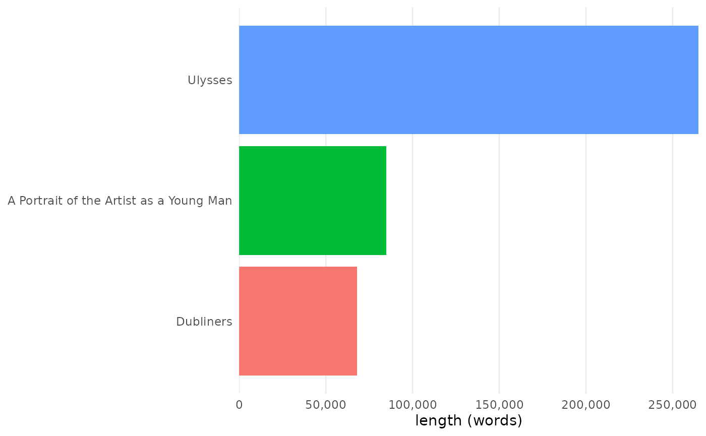

### Word frequencies

Using
[`visualize()`](https://jmclawson.github.io/tmtyro/reference/visualize.md)
after
[`add_frequency()`](https://jmclawson.github.io/tmtyro/reference/add_frequency.md)
will chart the most frequent words of each document.

``` r
corpus_joyce |> 
  add_frequency() |> 
  visualize()
```


[`visualize()`](https://jmclawson.github.io/tmtyro/reference/visualize.md)
takes additional arguments for customizing results.

``` r
counts_dubliners |> 
  visualize(rows = 1:3, 
            color_y = TRUE, 
            reorder_y = TRUE)
```

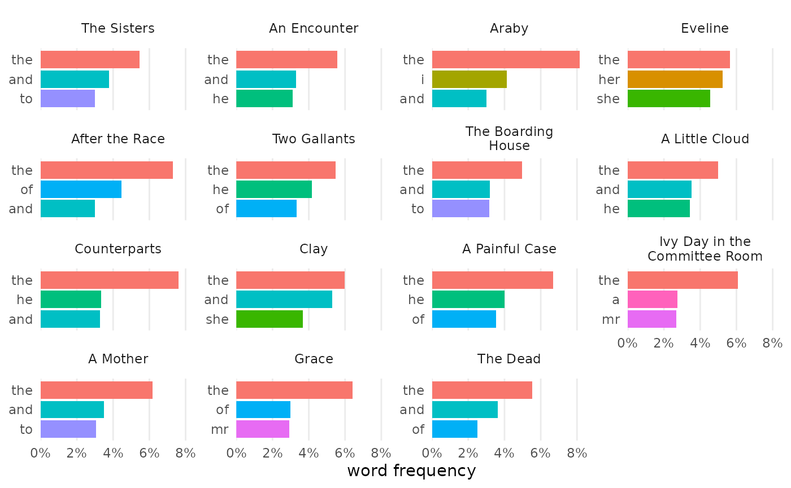

#### Document-frequency matrix

For a document-frequency matrix,
[`visualize()`](https://jmclawson.github.io/tmtyro/reference/visualize.md)
will prepare a heatmap:

``` r
corpus_dubliners |> 
  expand_documents() |> 
  visualize()
```

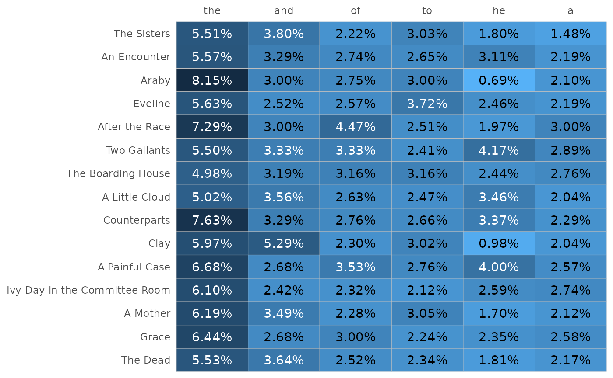

### Vocabulary richness

When used after
[`add_vocabulary()`](https://jmclawson.github.io/tmtyro/reference/add_vocabulary.md),
[`visualize()`](https://jmclawson.github.io/tmtyro/reference/visualize.md)
charts each document by its length and the number of unique tokens. A
figure like this is useful to compare documents by their rate of
vocabulary growth.

``` r
corpus_dubliners |> 
  add_vocabulary() |> 
  visualize()
```

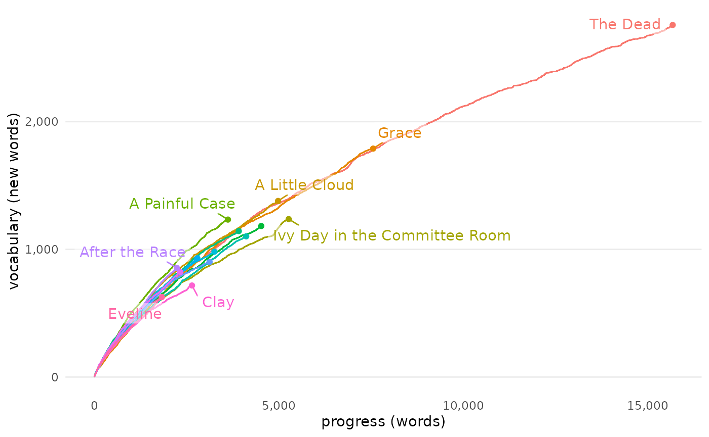

Other features, such as type-token ratio (“ttr”), hapax introduction
ratio (“hir”), or a sampling of hapax legomena (“hapax”) can also be
shown.

``` r
vocab_dubliners |> 
  visualize("ttr")
```

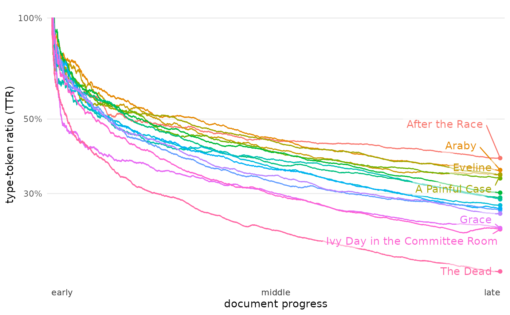

``` r
corpus_joyce |> 
  add_vocabulary() |> 
  visualize("hapax")
```

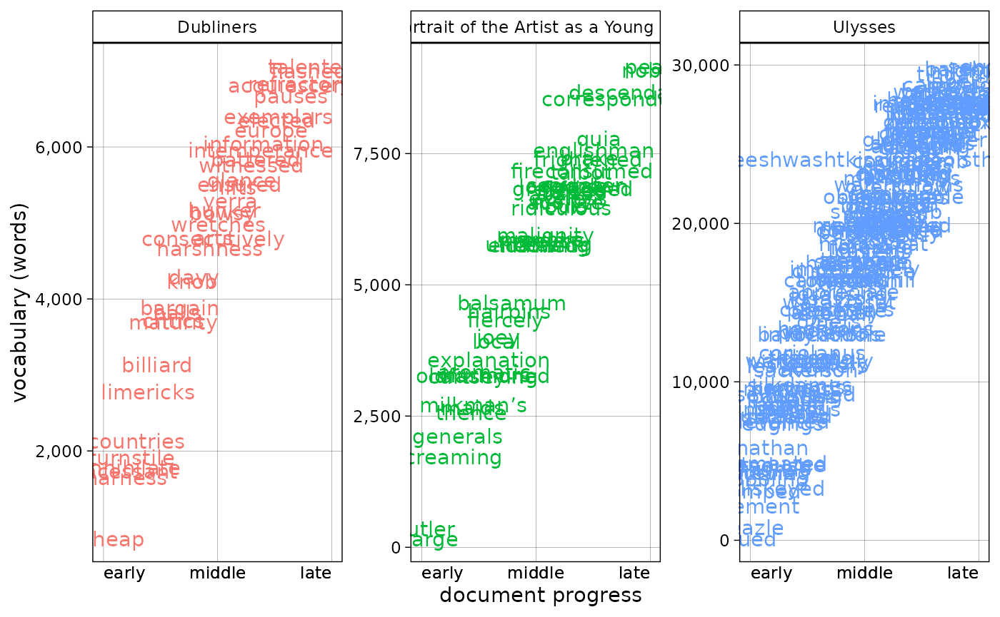

### Sentiment

For sentiment analysis,
[`visualize()`](https://jmclawson.github.io/tmtyro/reference/visualize.md)
allows for comparison among documents in a set.

``` r
sentiment_dubliners |> 
  visualize()
```

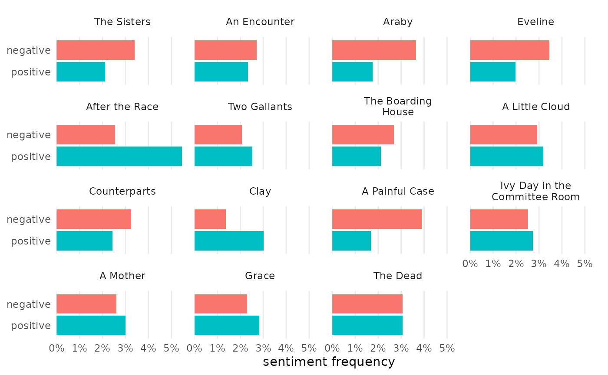

The `ignore` parameter stipulates values to remove from the Y-axis to
focus a figure.

``` r
sentiment_ulysses |> 
  visualize(ignore = c("anger", "anticipation", "disgust", "fear", "trust", "positive", "negative"))
```

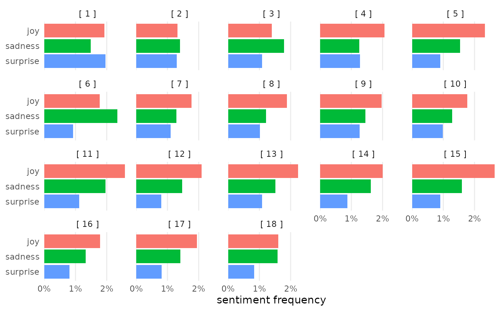

### N-grams

For n-grams,
[`visualize()`](https://jmclawson.github.io/tmtyro/reference/visualize.md)
typically returns a network visualization inspired by the bigram network
in *Text Mining with R*.

``` r
bigrams_joyce |> 
  visualize()
```

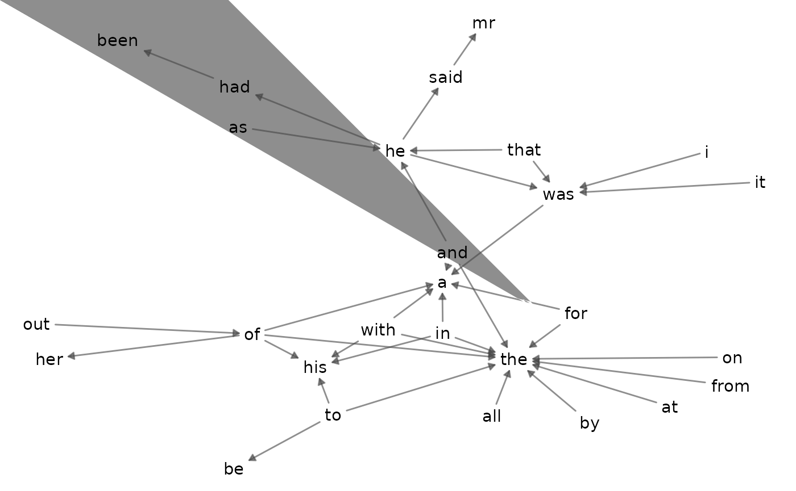

### Combining n-grams

N-gram frequencies can be compared by combining them before
visualization. Certain arguments allow for deviation from typical
charts, including choosing the rows to chart and modifying colors to be
set by values on the Y-axis.

``` r
bigrams_joyce |> 
  dplyr::filter(word_1 == "he") |> 
  combine_ngrams() |> 
  visualize(rows = 1:5, color_y = TRUE)
```


### Tf-idf

[`visualize()`](https://jmclawson.github.io/tmtyro/reference/visualize.md)
returns bars showing the top words for each document. This can be a
useful way to differentiate texts in a set from each other. Because
`tfidf_dubliners` was prepared with `load_texts(remove_names = TRUE)`,
the resulting chart shows clearer delineation of topics characteristic
of the stories in Joyce’s collection:

``` r
tfidf_dubliners |> 
  visualize(rows = 1:4)
```

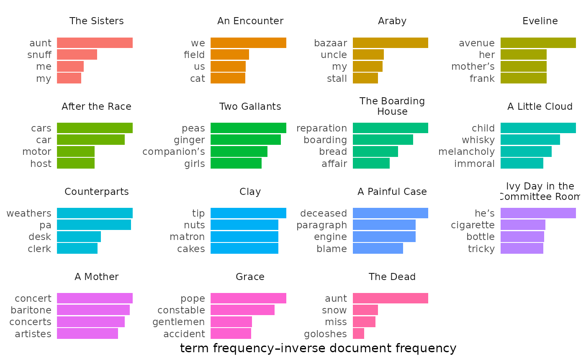

### Changing colors

[`change_colors()`](https://jmclawson.github.io/tmtyro/reference/change_colors.md)
does what its name implies. By default, it adopts the “Dark2” palette
from Brewer.

``` r
sentiment_dubliners |> 
  visualize() |> 
  change_colors()
```

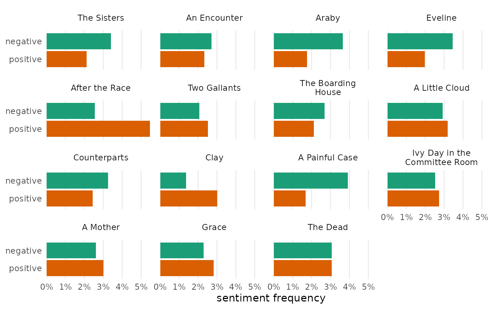

Colors can be chosen manually.

``` r
library(ggraph)
bigrams_joyce |> 
  visualize(top_n = 60) |> 
  change_colors(c("#999999", 
                  "orange", 
                  "darkred"))
```

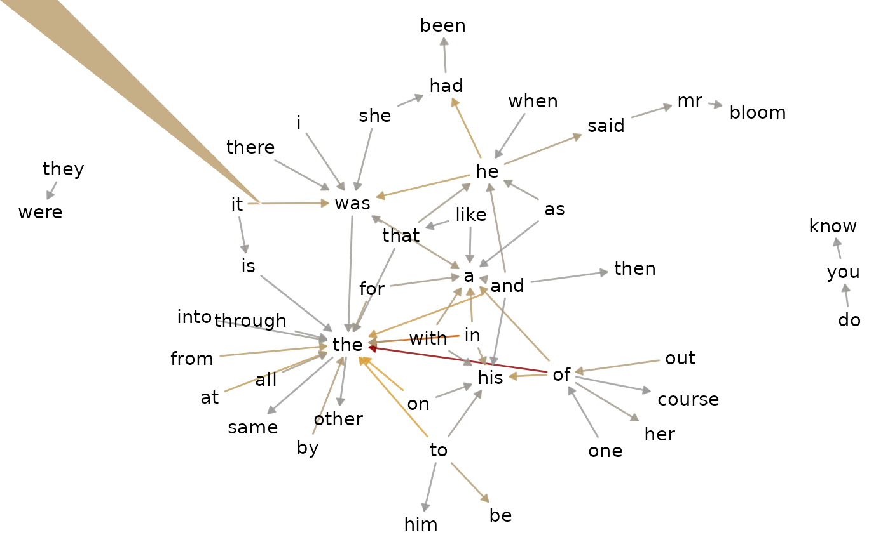

Optionally, use a named vector to set some colors by value instead of by
order. By default unnamed colors are gray.

``` r
bigrams_joyce |> 
  dplyr::filter(word_1 == "he") |> 
  combine_ngrams() |> 
  visualize(rows = 1:5, color_y = TRUE, reorder_y = TRUE) |> 
  change_colors(c(
    "he is" = "darkorange",
    "he has" = "orange"))
```

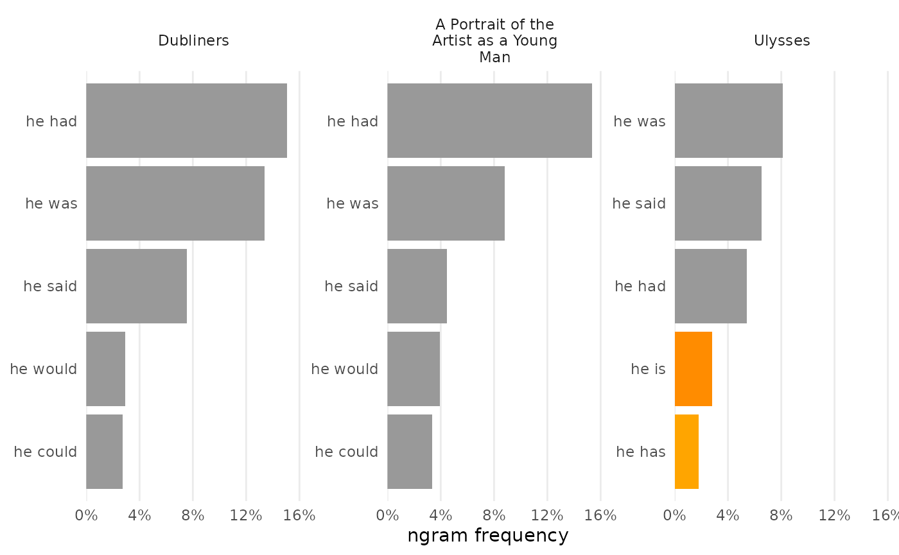

Unnamed colors fill in as needed.

``` r
bigrams_joyce |> 
  dplyr::filter(word_1 == "he") |> 
  combine_ngrams() |> 
  visualize(rows = 1:5, color_y = TRUE, reorder_y = TRUE) |> 
  change_colors(c(
    # Highlight two bars as outliers:
    "he is" = "darkorange",
    "he has" = "orange", 
    # Custom gradient palette:
    "midnightblue", "lightseagreen", "mediumspringgreen"
    ))
```


Or choose a predetermined color set and palette, as described in
function documentation.

``` r
tfidf_dubliners |> 
  visualize(rows = 1:4) |> 
  change_colors(colorset = "viridis", palette = "mako", direction = -1)
```

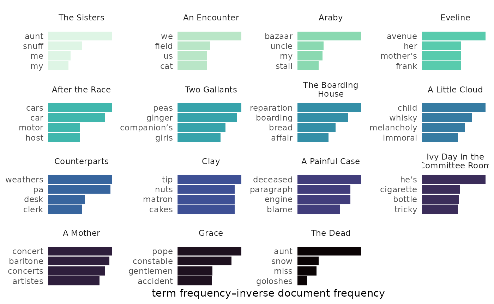

### Italicizing titles

Before sharing a figure,
[`italicize_titles()`](https://jmclawson.github.io/tmtyro/reference/italicize_titles.md)
adds one more step of polish:

``` r
bigrams_joyce |> 
  combine_ngrams() |> 
  visualize(rows = 1:5, color_y = FALSE, reorder_y = TRUE) |> 
  italicize_titles()
```

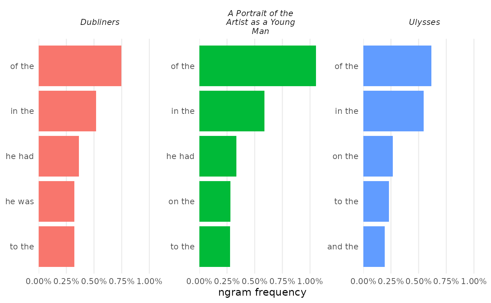

``` r
corpus_joyce |> 
  visualize() |> 
  italicize_titles()
```

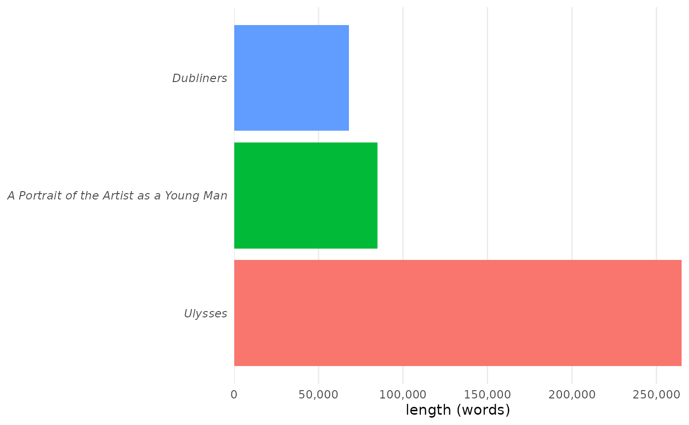

## Explaining process

When it’s time to write up the methods used to find a set of
conclusions, it’s important to document the steps taken.
[`narrativize()`](https://jmclawson.github.io/tmtyro/reference/narrativize.md)
helps turn a logged set of steps into bullet points or a paragraph of
methods:

``` r
bigrams_joyce |> 
  narrativize()
#>  - Retrieved a corpus from Project Gutenberg using ID numbers 2814, 4217, and 4300.
#>  - Moved column `subsection` into body text.
#>  - Loaded texts by tokenizing words, converting to lowercase, and preserving paragraph breaks.
#>  - Identified documents using the column `title`.
#>  - Constructed bigram sequences from the text.
```

Options allow for changes in format and person, but the final output
will still need some manual tweaking.

``` r
bigrams_joyce |> 
  narrativize(format = "text", person = "we", return = "html")
```

First we retrieved a corpus from Project Gutenberg using ID numbers
2814, 4217, and 4300. Then we moved column \`subsection\` into body
text. Next, we loaded texts by tokenizing words, converting to
lowercase, and preserving paragraph breaks. We identified documents
using the column \`title\`. Finally, we constructed bigram sequences
from the text.
