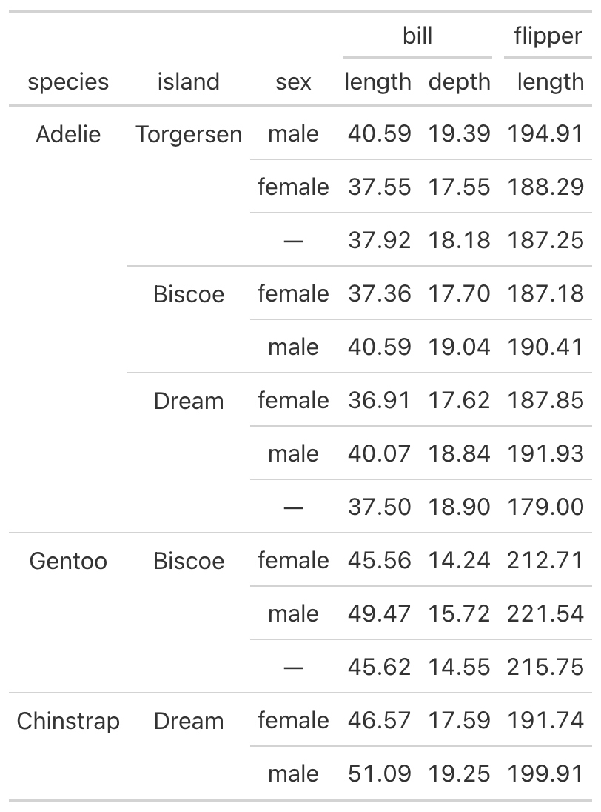

# Collapse gt rows in the style of kableExtra

Collapse gt rows in the style of kableExtra

## Usage

``` r
collapse_rows(df_g, col, lookleft = TRUE)
```

## Arguments

- df_g:

  A gt table data object

- col:

  The column to collapse

- lookleft:

  Whether to depend any collapsing on the column one step left

## Value

A gt table data object

## Examples

    library(gt)
    library(palmerpenguins)
    library(tmtyro)

    penguins_gt <-
      penguins |>
      select(-year) |>
      summarize(
        across(
          ends_with("_mm"), mean, na.rm = TRUE),
        .by = c(species, island, sex)) |>
      gt() |>
      fmt_number() |>
      tab_spanner(
        "bill",
        columns = starts_with("bill_")) |>
      tab_spanner(
        "flipper",
        starts_with("flip")) |>
      cols_label(
        bill_length_mm = "length",
        bill_depth_mm = "depth",
        flipper_length_mm = "length") |>
      sub_missing()

    penguins_gt |>
      collapse_rows(species) |>
      collapse_rows(island)



## See also

Other table helpers:
[`tabulize()`](https://jmclawson.github.io/tmtyro/reference/tabulize.md)
