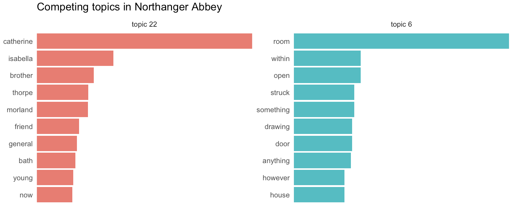

# Plot bars for words in each topic

Plot bars for words in each topic

## Usage

``` r
plot_topic_bars(
  lda,
  topics,
  top_n = 10,
  expand_bars = TRUE,
  save = TRUE,
  saveas = "png",
  savedir = "plots"
)
```

## Arguments

- lda:

  The topic model to be used.

- topics:

  The topic numbers to view

- top_n:

  The number of words to show for each topic

- expand_bars:

  Whether to stretch the bars the length of the X-axis for each facet

- save:

  By default, the visualization will be saved. Set to FALSE to skip
  saving.

- saveas:

  The filetype for saving resulting visualizations. By default, the
  files will be in "png" format, but other options such as "pdf" or "jpg
  will also work.

- savedir:

  The directory for saving output images. By default, this is set to
  "plots/".

## Value

A ggplot2 visualization showing the top words in each of the chosen
topics.

## Examples

    austen <-
      get_gutenberg_corpus(c(105, 121, 141, 158, 161, 946, 1342)) |>
      dplyr::select(doc_id = title, text)

    austen_lda <-
      austen |>
      make_topic_model(k = 30)

    austen_lda |>
      plot_topic_bars(topics = c(22, 6)) +
      labs(title = "Competing topics in Northanger Abbey")



## See also

Other visualizing helpers:
[`change_colors()`](https://jmclawson.github.io/tmtyro/reference/change_colors.md),
[`italicize_titles()`](https://jmclawson.github.io/tmtyro/reference/italicize_titles.md),
[`plot_bigrams()`](https://jmclawson.github.io/tmtyro/reference/plot_bigrams.md),
[`plot_doc_word_bars()`](https://jmclawson.github.io/tmtyro/reference/plot_doc_word_bars.md),
[`plot_doc_word_heatmap()`](https://jmclawson.github.io/tmtyro/reference/plot_doc_word_heatmap.md),
[`plot_hapax()`](https://jmclawson.github.io/tmtyro/reference/plot_hapax.md),
[`plot_hir()`](https://jmclawson.github.io/tmtyro/reference/plot_hir.md),
[`plot_tf_idf()`](https://jmclawson.github.io/tmtyro/reference/plot_tf_idf.md),
[`plot_topic_distributions()`](https://jmclawson.github.io/tmtyro/reference/plot_topic_distributions.md),
[`plot_topic_wordcloud()`](https://jmclawson.github.io/tmtyro/reference/plot_topic_wordcloud.md),
[`plot_ttr()`](https://jmclawson.github.io/tmtyro/reference/plot_ttr.md),
[`plot_vocabulary()`](https://jmclawson.github.io/tmtyro/reference/plot_vocabulary.md),
[`theme_tmtyro()`](https://jmclawson.github.io/tmtyro/reference/theme_tmtyro.md),
[`visualize()`](https://jmclawson.github.io/tmtyro/reference/visualize.md)
