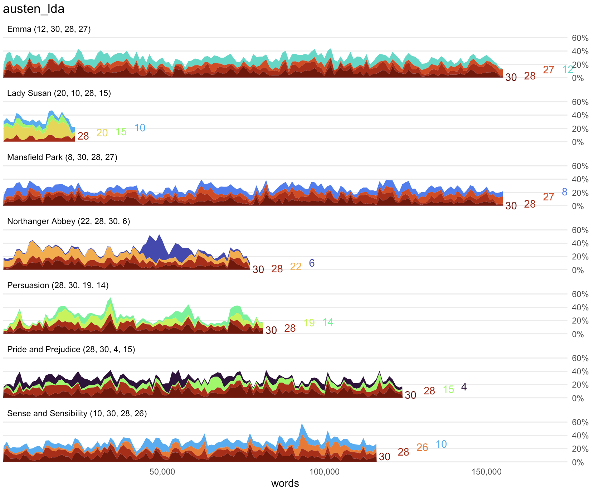

# Plot topic distributions

`plot_topic_distributions()` prepares a visualization for exploring the
most significant topics in each document over time.

## Usage

``` r
plot_topic_distributions(
  lda,
  top_n = 4,
  direct_label = TRUE,
  title = TRUE,
  save = TRUE,
  saveas = "png",
  savedir = "plots",
  omit = NULL,
  smooth = TRUE
)
```

## Arguments

- lda:

  The topic model to be used.

- top_n:

  The number of topics to visualize. By default, the top 4 topics in
  each document will be shown.

- direct_label:

  By default, directly labels topic numbers on the chart. Set it to
  FALSE to show a legend corresponding to each color.

- title:

  By default, the function will add a title to the chart, corresponding
  to the name of the object passed to the `lda` parameter. Set it to
  FALSE to return a chart with no title.

- save:

  By default, the visualization will be saved. Set to FALSE to skip
  saving.

- saveas:

  The filetype for saving resulting visualizations. By default, the
  files will be in "png" format, but other options such as "pdf" or "jpg
  will also work.

- savedir:

  The directory for saving output images. By default, this is set to
  "plots/".

- omit:

  Upon exploration, some topics may be found to contain common stop
  words or other unhelpful material. Use the `omit` parameter to define
  a vector of topic numbers you wish to omit from a visualization.

- smooth:

  After samples are rejoined, the measured value of each topic will vary
  wildly, even in samples that are beside each other in a document. This
  can make charts distractingly jittery. The default TRUE value of this
  parameter reduces chart noise by calculating rolling averages across
  three samples. Set the parameter to FALSE to skip this step and allow
  for visualization of extreme values.

## Value

A ggplot2 visualization showing vertical facets of texts. The length of
each text is shown on the X-axis, and area plots on the Y-axis show the
distribution of the strongest topics in each part of the text.

## Examples

    austen <-
      get_gutenberg_corpus(c(105, 121, 141, 158, 161, 946, 1342)) |>
      dplyr::select(doc_id = title, text)

    austen_lda <-
      austen |>
      make_topic_model(k = 30)

    plot_topic_distributions(austen_lda)



## See also

Other visualizing helpers:
[`change_colors()`](https://jmclawson.github.io/tmtyro/reference/change_colors.md),
[`italicize_titles()`](https://jmclawson.github.io/tmtyro/reference/italicize_titles.md),
[`plot_bigrams()`](https://jmclawson.github.io/tmtyro/reference/plot_bigrams.md),
[`plot_doc_word_bars()`](https://jmclawson.github.io/tmtyro/reference/plot_doc_word_bars.md),
[`plot_doc_word_heatmap()`](https://jmclawson.github.io/tmtyro/reference/plot_doc_word_heatmap.md),
[`plot_hapax()`](https://jmclawson.github.io/tmtyro/reference/plot_hapax.md),
[`plot_hir()`](https://jmclawson.github.io/tmtyro/reference/plot_hir.md),
[`plot_tf_idf()`](https://jmclawson.github.io/tmtyro/reference/plot_tf_idf.md),
[`plot_topic_bars()`](https://jmclawson.github.io/tmtyro/reference/plot_topic_bars.md),
[`plot_topic_wordcloud()`](https://jmclawson.github.io/tmtyro/reference/plot_topic_wordcloud.md),
[`plot_ttr()`](https://jmclawson.github.io/tmtyro/reference/plot_ttr.md),
[`plot_vocabulary()`](https://jmclawson.github.io/tmtyro/reference/plot_vocabulary.md),
[`theme_tmtyro()`](https://jmclawson.github.io/tmtyro/reference/theme_tmtyro.md),
[`visualize()`](https://jmclawson.github.io/tmtyro/reference/visualize.md)
