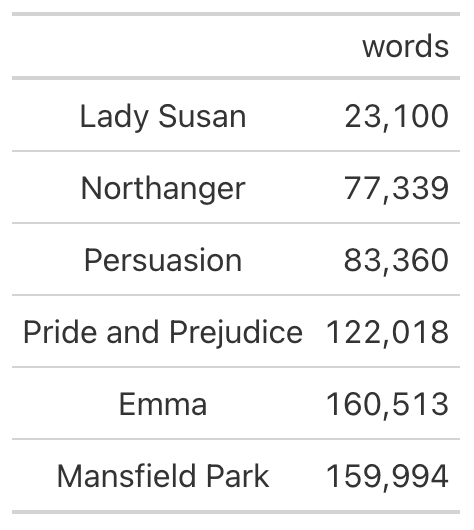
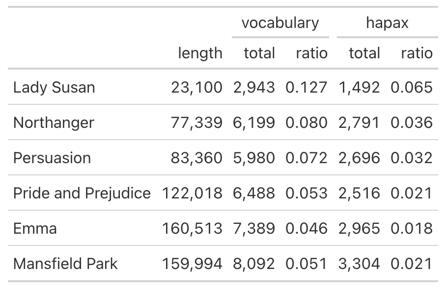
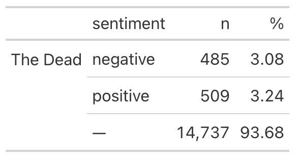

# Prepare a table of data

`tabulize()` provides a simple method for sharing results. Based on
previous functions used, `tabulize()` will choose a method, resolving to
one of a set of tables.

## Usage

``` r
tabulize(.data, ...)
```

## Arguments

- .data:

  data processed with one or more functions from `tmtyro`

- ...:

  Arguments passed on to
  [`tabulize.default`](https://jmclawson.github.io/tmtyro/reference/tabulize.default.md)

  `summary`

  :   Indicates whether to prepare a summary table or the rows as they
      exist

  `inorder`

  :   Indicates whether labels in the `doc_id` column should have their
      order preserved

  `count`

  :   Determines whether frequencies will be counted for individual
      features

  `rows`

  :   Chooses rows to be shown

## Value

A gt table data object

## Examples

    dubliners <- get_gutenberg_corpus(2814) |>
      load_texts() |>
      identify_by(part) |>
      standardize_titles()

    # A data frame with `doc_id` and `word` columns will show word counts by default
    dubliners |>
       tabulize()



    # Applying tmtyro functions will prepare other tables
      dubliners |>
       add_vocabulary() |>
       tabulize()



      dubliners |>
         dplyr::filter(doc_id == "The Dead") |>
         add_sentiment() |>
         tabulize()



## See also

Other table helpers:
[`collapse_rows()`](https://jmclawson.github.io/tmtyro/reference/collapse_rows.md)
