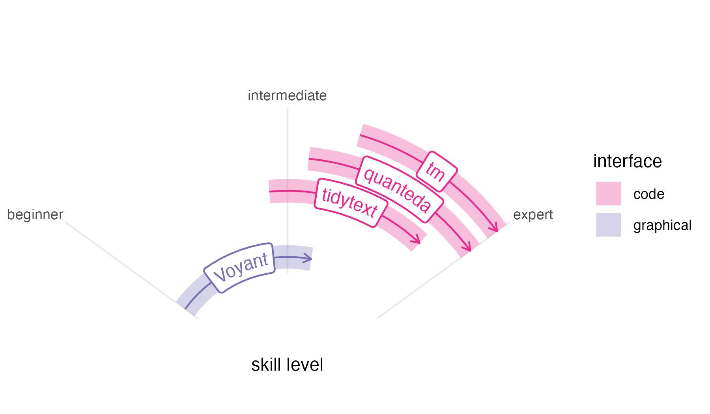
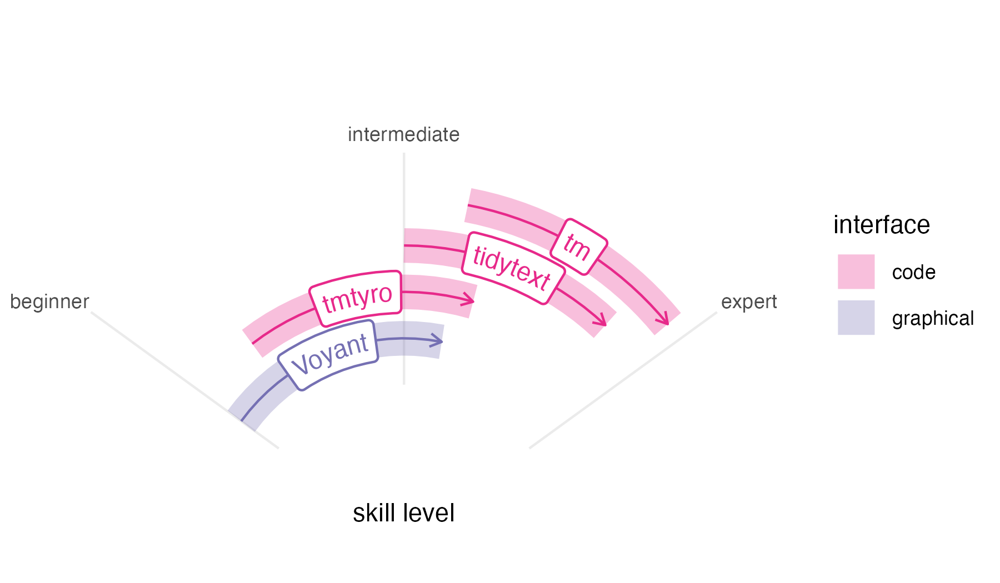

```{r, include = FALSE}
knitr::opts_chunk$set(
  collapse = TRUE,
  comment = "#>"
)
```

```{r}
#| echo: false
#| eval: false
library(ggplot2)
make_radial_plot <- function(data) {
  the_plot <- 
    data |> 
    ggplot(
    aes(x = position, xend = position,
        y = start, yend = end,
        color = type)
  ) +
  geom_segment(
    linewidth = 6.7,
    alpha = 0.3, show.legend = TRUE) +
  coord_radial(theta = "y", 
               start = -0.3 * pi, end = 0.3 * pi,
               inner.radius = 0.4, expand = FALSE) +
  scale_y_continuous(
    breaks = c(0, 50, 100),
    limits = c(0, 100),
    labels = c("beginner", "intermediate", "expert")
  ) +
  scale_x_continuous(
    limits = c(1.5,6.5),
    breaks = c(0, 50, 100),
    labels = c("beginner", "intermediate", "expert")
    ) +
  labs(x = NULL, y = "skill level", color = "interface") +
  geomtextpath::geom_labelsegment(
    aes(label = tool), show.legend = FALSE,
    # hjust = 0,
    arrow = arrow(length = unit(0.03, "npc"))) +
  theme_minimal() +
  theme(panel.grid.major.x = element_blank(),
        panel.grid.minor.x = element_blank(),
        panel.grid.minor.y = element_blank(),
        axis.text.y = element_blank(),
        axis.ticks.y = element_blank())
  
  if ("comparison_set" %in% colnames(data)) {
    the_plot <- the_plot +
      facet_wrap(facets = vars(comparison_set))
  }
  the_plot <- the_plot |> 
    change_colors(start = 3, direction = -1)
}

comparison <- data.frame(
  tool = c("Voyant", "tmtyro", "tidytext", "quanteda", "tm") |> 
    forcats::fct_inorder(),
  position = c(2, 3, 4, 5, 6),
  start = c(0, 10, 45, 55, 65),
  end = c(60, 65, 90, 100, 100),
  type = c("graphical", "code", "code", "code", "code"))

comparison |>
  dplyr::filter(tool != "tmtyro") |>
  make_radial_plot() +
  grid.brackets(100, 100, 2.5, 100, lwd=1, ticks=NA)

grid::grid.locator(unit="native")
grid.brackets(1.5, 100, 2.5, 100, lwd=1, ticks=NA)


ggsave("skill_speedometer_without.png", bg = "white", width = 6, height = 3.5)

comparison |> 
  make_radial_plot() 

ggsave("skill_speedometer.png", bg = "white", width = 6, height = 3.5)
```

This package does not exist in a vaccuum. Wonderful text mining tools already exist for digital humanities classrooms and researchers working with text data, including the online tool [Voyant](https://voyant-tools.org), which is both powerful and easy to use for beginners; the [tidytext](https://juliasilge.github.io/tidytext/) package in R, designed to work with the popular [tidyverse](https://tidyverse.tidyverse.org) package suite; the [quanteda](https://quanteda.io/index.html) package in R, with many options offering precision and power; and the [tm](https://tm.r-forge.r-project.org) package in R, a long-standing tool used by specialists. Their designs situate them for different audiences and purposes. Similarly, the tmtyro package is designed with a particular audience and purpose in mind. 

## In context



Voyant is one of the best-known tools for working with text data in the humanities. Begun in development by Stéfan Sinclair and Geoffrey Rockwell over more than twenty years ago, it has become a standard---and with good reason. Its graphical interface makes it accessible to novices without compromising ability or features. Still, Voyant's easy-to-use interface ultimately limits users' growth, since that same interface can keep Voyant from serving as a skills ramp to other options.

Unlike Voyant, code-based methods for working with text offer both reproducibility and open-ended tooling. In R, the tm package created by Ingo Feinerer and Kurt Hornik is among the oldest and most widely used packages for text mining.^[Among the three packages discussed here, tm is by far the most downloaded from CRAN, with more than 57 thousand downloads last month, compared to 44 thousand for tidytext and 37 thousand for quanteda.] It emphasizes corpus creation and choosing text features for study. First published on CRAN in 2007, it predates the other packages described here by almost a decade, and its data design makes it sometimes hard to work with modern workflows. 

The quanteda package, released by Kenneth Benoit in 2015, is in continual development. It provides workflows for corpus creation, choosing features, searching words in context, working with custom dictionaries, and visualizing results, among other things, providing helpful documentation along the way. But its abundance of options and multiple-step workflows can be overwhelming for a beginner. And like tm, quanteda's primary data design is not ideally suited for popular packages.^[Among these, dplyr's monthly download numbers typically rival quanteda's lifetime downloads. And although an experimental package *quanteda.tidy* was started to make quanteda work more consistently with dplyr and other packages in the tidyverse family, it seems no longer in development.] Nevertheless, quanteda provides power and specialized functionality that makes it worth a steep learning curve.

The newest of these four is tidytext, created by Julia Silge and David Robinson in 2019. Unlike the other two, tidytext is made using a "tidy" design philosophy that is consistent with many popular R packages.^[This design might account for its higher download rate when compared to the more powerful quanteda.] Additionally, a companion book, [*Text Mining with R*](https://www.tidytextmining.com), offers impressive documentation, easing the learning curve for anyone new to text mining. But this book's preface acknowledges a starting point quite a ways above zero, expecting that "the reader is at least slightly familiar with dplyr, ggplot2, and the %>% 'pipe' operator in R." These expectations make tidytext tough for complete beginners who must get up to speed with other tools before using it.



In this context, the tmtyro package steps cautiously into the remaining space to fill a particular need. Developed while teaching two semesters of an undergraduate course on literary text mining, it grew from a folder of "helper" functions written for students. Our course was taught in the English department, and it was never meant to be a "coding class" so much as one that induced students to think about text in new ways. The syllabus followed through examples from *Text Mining in R* and, ambitiously, *Text Analysis with R for Students of Literature*, by Matthew Jockers and Rosamond Thalken, pairing methods with applications in recent research. Each week, students applied techniques to ask their own questions about their own selections of writing. Having working tools in front of us helped everyone test the boundaries of this new world and map how we might follow similar paths to those laid out in the readings. 

Like Voyant, tmtyro is designed for a beginner, and it strives for predictability. Workflows are provided for loading texts from a folder or for getting a corpus of texts from online collections. Once texts are loaded, repetitive conventions for function names make it easy to add columns for analysis in a single step, and generic functions handle details of tables and figures. 

Most importantly, tmtyro provides a skills ramp for users who outgrow it. Code workflows are designed to help beginners move quickly at the start to try things out. From there, a student who gains confidence in the methods provided by the package might step beyond it to tweak a visualization using functions from ggplot2. A researcher wishing to work with a subset of titles will begin to understand methods from dplyr. And since tmtyro's data design is based on that of tidytext, a user can transition between both packages seamlessly, using them together. Nobody is expected to stick with tmtyro forever, but functions are designed to remain useful long past the "tyro" stage.

## In code

Because each of these packages was developed for different audiences, they take different approaches to common steps. The functions and approaches used by tmtyro seem most similar to those of tidytext. At the same time, many details or choices are hidden to simplify the interface and prioritize getting results.

The code to use each package is shown below for comparison. Every approach assumes the same object definition showing the path to a folder of text files:

```{r}
#| eval: false
text_directory <- "path/to/files"
```

It is likely that someone more familiar with a given package would take a different approach, but these examples demonstrate the method someone might try after searching documentation and the internet. When methods are benchmarked, some might be faster than others, but speeds feel comparable in testing.

```{r}
#| include: false

text_directory <- "~/Documents/DH_experiments/Corpora/Durrell-Corpus/The_Avignon_Quintet"
```


### Load texts from a folder {.tabset}

This first comparison shows a first step of loading a corpus from a local folder of texts. 

#### tmtyro

```{r}
#| label: load-tmtyro
#| eval: false
library(tmtyro)

my_corpus <- load_texts(text_directory)
```

Behind the scenes, tmtyro's `load_texts()` uses functions from base R and a number of packages: dplyr, forcats, purrr, rlang, stringr, tibble, tidyr, and tidytext. When lemmatizing or tagging parts of speech, it also uses textstem, openNLP, and NLP.

#### tidytext

```{r}
#| label: load-tidytext
#| eval: false
library(tidytext)
library(dplyr)
library(readr)
library(stringr)

my_corpus_tt <- 
  data.frame(
    doc_id = list.files(text_directory, "\\.txt$")) |> 
  mutate(
    text = paste(text_directory, doc_id, sep = "/") |> 
      read_file(),
    .by = doc_id) |> 
  mutate(
    doc_id = str_remove_all(doc_id, "[.]txt")) |> 
  unnest_tokens(word, text)
```

```{r}
#| include: false
count <- tmtyro::count
```


#### quanteda

```{r}
#| label: load-quanteda
#| eval: false
library(quanteda)
library(readtext)

my_corpus_qu <- 
  readtext(
    paste0(text_directory, "/*.txt"),
    docvarsfrom = "filenames") |> 
  corpus() |> 
  tokens()
```

#### tm

```{r}
#| label: load-tm
#| eval: false
library(tm)

my_corpus_tm <- DirSource(text_directory) |> 
  Corpus(readerControl = list(reader = readPlain))
```

### Remove stop words {.tabset}

Removing stop words is a common step in text analysis. Each of these examples continues directly from the previous step of loading texts.

#### tmtyro

```{r}
#| label: stopwords-tmtyro
#| eval: false
sans_stopwords <- drop_stopwords(my_corpus)
```

`drop_stopwords()` uses functions from dplyr and tidytext.

#### tidytext

```{r}
#| label: stopwords-tidytext
#| eval: false
sans_stopwords_tt <- anti_join(my_corpus_tt, get_stopwords())
```

#### quanteda

```{r}
#| label: stopwords-quanteda
#| eval: false
library(stopwords)

sans_stopwords_qu <- tokens_remove(my_corpus_qu, stopwords("english"))
```

#### tm

```{r}
#| label: stopwords-tm
#| eval: false
sans_stopwords_tm <-  
  tm_map(my_corpus_tm,
         removeWords, 
         stopwords("english"))
```

### Add sentiment {.tabset}

A pre-trained lexicon is needed to tag texts for sentiment. The process differs for each package. 

#### tmtyro

```{r}
#| label: sentiment-tmtyro
#| eval: false
sentiment <- add_sentiment(my_corpus)
```

`add_sentiment()` uses functions from rlang, dplyr, textdata, and tidytext.

#### tidytext

```{r}
#| label: sentiment-tidytext
#| eval: false
sentiment_tt <- inner_join(my_corpus_tt, get_sentiments())
```

#### quanteda

```{r}
#| label: sentiment-quanteda
#| eval: false
sentiment_qu <- 
  tokens_lookup(
    my_corpus_qu,
    dictionary = data_dictionary_LSD2015, 
    exclusive = FALSE)
```

#### tm

```{r}
#| label: sentiment-tm
#| eval: false
library(syuzhet)

sentiment_tm <- get_sentiment(my_corpus_tm)

# This doesn't actually do the job. I'm not sure what the equivalent would be using tm.
```

### Measure Tf-idf {.tabset}

Term frequency--inverse document frequency is a method for weighing words by their contribution to distinctness within a corpus.

#### tmtyro

```{r}
#| label: tfidf-tmtyro
#| eval: false
tfidf <- summarize_tf_idf(my_corpus)
```

`summarize_tf_idf()` uses functions from dplyr and tidytext.

#### tidytext

```{r}
#| label: tfidf-tidytext
#| eval: false

tfidf_tt <- my_corpus_tt |>
 count(doc_id, word, sort = TRUE)

total_words <- tfidf_tt |> 
  group_by(doc_id) |> 
  summarize(total = sum(n))

tfidf_tt <- left_join(tfidf_tt, total_words) |> 
  bind_tf_idf(word, doc_id, n)
```

#### quanteda

```{r}
#| label: tfidf-quanteda
#| eval: false
tfidf_qu <- dfm(my_corpus_qu) |> 
  docfreq(scheme = "inverse")
```

#### tm

```{r}
#| label: tfidf-tm
#| eval: false
tfidf_tm <- weightTfIdf(DocumentTermMatrix(my_corpus_tm))
```

### Visualize most frequent words {.tabset}

Measuring word frequency is a basic step for text mining. Well-prepared figures can help communicate results.

```{r}
#| include: false
library(tmtyro)
```


#### tmtyro

```{r}
#| label: viz-tmtyro
#| eval: false
my_corpus |> 
  count(word) |> 
  visualize()
```

The `count()` function is reexported from dplyr. For showing word counts, `visualize()` also uses ggplot2. Other kinds of visualizations will add the forcats, scales, tidyr, ggraph, and igraph packages.

#### tidytext

```{r}
#| label: viz-tidytext
#| eval: false
library(ggplot2)

my_corpus_tt |> 
  count(word, sort = TRUE) |> 
  slice_head(n = 10) |> 
  mutate(proportion = n / sum(n)) |> 
  ggplot(aes(proportion, reorder(word, proportion))) +
  geom_col() +
  labs(y = NULL)
```

#### quanteda

```{r}
#| label: viz-quanteda
#| eval: false
library(quanteda.textstats)
library(ggplot2)

tokens(my_corpus_qu,
       remove_punct = TRUE) |> 
  dfm() |> 
  textstat_frequency(n = 10) |> 
  ggplot(aes(x = frequency,
             y = reorder(feature, -rank))) +
  geom_col() + 
  labs(y = NULL)
```

#### tm

```{r}
#| label: viz-tm
#| eval: false
library(Rgraphviz)

plot(TermDocumentMatrix(my_corpus_tm),
     terms = findFreqTerms(TermDocumentMatrix(my_corpus_tm))[1:10])

# This doesn't actually work, since the necessary package was removed from CRAN.
```

### Complete workflow {.tabset}

This last section compares four packages for walking through a common workflow, using each to load a folder of texts, remove stopwords, and visualize most frequent words.

#### tmtyro

```{r}
#| label: workflow-tmtyro
#| eval: false
library(tmtyro)

load_texts(text_directory) |> 
  drop_stopwords() |> 
  count(word) |> 
  visualize()
```

#### tidytext

```{r}
#| label: workflow-tidytext
#| eval: false
library(tidytext)
library(dplyr)
library(tibble)
library(ggplot2)
data(stop_words)

data.frame(
    doc_id = list.files(text_directory, "\\.txt$")) |> 
  mutate(
    text = paste(text_directory, doc_id, sep = "/") |> 
      read_file(),
    .by = doc_id) |> 
  unnest_tokens(word, text) |> 
  anti_join(stop_words) |> 
  count(word, sort = TRUE) |> 
  slice_head(n = 10) |> 
  mutate(proportion = n / sum(n)) |> 
  ggplot(aes(proportion, reorder(word, proportion))) +
  geom_col() +
  labs(y = NULL)
```

#### quanteda

```{r}
#| label: workflow-quanteda
#| eval: false
library(quanteda)
library(readtext)
library(stopwords)
library(ggplot2)

readtext(
    paste0(text_directory, "/*.txt"),
    docvarsfrom = "filenames") |> 
  corpus() |> 
  tokens(remove_punct = TRUE) |> 
  tokens_remove(stopwords("english")) |> 
  dfm() |> 
  textstat_frequency(n = 10) |> 
  ggplot(aes(x = frequency,
             y = reorder(feature, -rank))) +
  geom_col() + 
  labs(y = NULL)
```

#### tm

```{r}
#| label: workflow-tm
#| eval: false
library(tm)
library(Rgraphviz)

Corpus(
  DirSource(text_directory), 
  readerControl = list(reader = readPlain)) |> 
  tm_map(removeWords, 
         stopwords("english")) |> 
  TermDocumentMatrix() |> 
  plot(terms = findFreqTerms(TermDocumentMatrix(my_corpus_tm))[1:10])

# This doesn't actually work, since the necessary package was removed from CRAN.
```

## References
