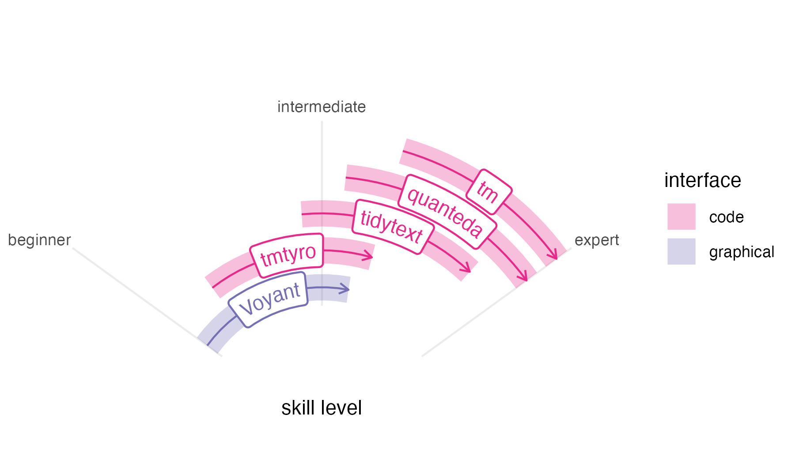

```{r, include = FALSE}
knitr::opts_chunk$set(
  collapse = TRUE,
  comment = "#>"
)
```

```{r setup}
#| echo: false
library(tmtyro)
```

```{r}
#| echo: false
#| eval: false
library(ggplot2)
make_radial_plot <- function(data) {
  the_plot <- 
    data |> 
    ggplot(
    aes(x = position, xend = position,
        y = start, yend = end,
        color = type)
  ) +
  geom_segment(
    linewidth = 7,
    alpha = 0.3, show.legend = TRUE) +
  coord_radial(theta = "y", 
               start = -0.3 * pi, end = 0.3 * pi,
               inner.radius = 0.4, expand = FALSE) +
  scale_y_continuous(
    breaks = c(0, 50, 100),
    limits = c(0, 100),
    labels = c("beginner", "intermediate", "expert")
  ) +
  scale_x_continuous(limits = c(1,6)) +
  labs(x = NULL, y = "skill level", color = "interface") +
  geomtextpath::geom_labelsegment(
    aes(label = tool), show.legend = FALSE,
    arrow = arrow(length = unit(0.03, "npc"))) +
  theme_minimal() +
  theme(panel.grid.major.x = element_blank(),
        panel.grid.minor.x = element_blank(),
        panel.grid.minor.y = element_blank(),
        axis.text.y = element_blank(),
        axis.ticks.y = element_blank())
  
  if ("comparison_set" %in% colnames(data)) {
    the_plot <- the_plot +
      facet_wrap(facets = vars(comparison_set))
  }
  the_plot |> 
    change_colors(start = 3, direction = -1)
}

comparison <- data.frame(
  tool = c("Voyant", "tmtyro", "tidytext", "tm") |> 
    forcats::fct_inorder(),
  position = c(2, 3, 4, 5),
  start = c(0, 15, 50, 60),
  end = c(60, 65, 90, 97),
  type = c("graphical", "code", "code", "code"))

# comparison |> 
#   dplyr::filter(tool != "tmtyro") |> 
#   make_radial_plot() 

comparison |> 
  make_radial_plot() 

ggsave("skill_speedometer.png", bg = "white", width = 6, height = 3.5)
```


Working with text as data is a multi-step process. One of the first steps involves figuring out which texts you'd like to study and gathering them in one place. After this, you'll still need to load them in some structured way before anything else. Only then is it possible to "do text analysis": tagging parts of speech, normalizing by lemma, comparing features, measuring sentiment, and so on. But even after doing the work, you'll need to communicate findings by preparing compelling explanations, visualizations, and tables. 

The tmtyro package aims to make these steps fast and easy.

* Purpose-built functions for collecting a corpus let you focus on *what* instead of *how*.
* Scalable functions for loading a corpus provide room for growth, from simple word count to grammar parsing and lemmatizing.
* Additional functions standardize approaches for measuring word use and vocabulary uniqueness, detecting sentiment, assessing term frequency--inverse document frequency, working with n-grams, and even building topic models.
* One simple visualizing function manages most use cases, returning clean, publication-ready figures. Additional functions and arguments make it easy to customize output to suit your need.
* One simple function prepares publication-ready tables, automatically adjusting based on the kind of data used.
* Every function is offered as a verb using complementary syntax. This keeps workflows easy to build, easy to understand, and easy to explain.

## Differentiating tmtyro

Wonderful text mining tools already exist for digital humanities classrooms and researchers working with text data, including the online tool [Voyant](https://voyant-tools.org), which is both powerful and easy to use for beginners; the [tm](https://tm.r-forge.r-project.org) package in R, a long-standing tool used by specialists; and the comparatively recent [tidytext](https://juliasilge.github.io/tidytext/) package in R, designed to work with the "tidyverse" suite of packages. Their designs situate them for different audiences and purposes, but each is limited in part by lock-in or difficulty. The tmtyro package aims to address some of these concerns. 

[Voyant](https://voyant-tools.org) is one of the best tools for working with text data. Developed by Stéfan Sinclair & Geoffrey Rockwell more than twenty years ago, it has become a standard---and with good reason. Its graphical interface makes it accessible to complete novices without skimping on power or features. Still, everything has limits. Voyant's easy-to-use interface ultimately limits users' growth, since that interface keeps Voyant from serving as a skills ramp to other tools with more options.

Unlike fixed tools like Voyant, code-based methods for working with text offer both reproducibility and open-ended tooling. In R, the tidytext package is made using a "tidy data" design philosophy that is consistent with many popular R packages. A companion book, [*Text Mining with R*](https://www.tidytextmining.com), offers impressive documentation to the package, easing the learning curve for anyone new to text mining. But its [preface](https://www.tidytextmining.com/preface) acknowledges a starting point quite a ways above zero, expecting that "the reader is at least slightly familiar with dplyr, ggplot2, and the %>% 'pipe' operator in R." Without the book, tidytext is even less suited for beginners, leaving users to fend for themselves and find some other method to read files.

If the tidytext package is a helpful tool to be picked up by a seasoned R user familiar with the tidyverse, then the tm package, by contrast, is the kind of tool for which specialists will learn R to use. It predates the tidyverse package suite by nearly a decade, and its data design is often incompatible with those workflows. Nevertheless, it provides power and specialized functionality beyond these other tools, making it worth learning for those who need it.



The tmtyro package is designed to fit into a space left behind. In fact, it was developed over two semesters of teaching a course on literary text mining using R, following through examples from *Text Mining in R* while students applied techniques to ask their own questions about their own selections of texts. Taught in an English department, our course was was never meant to be a "coding class," even though it did walk some students through the process of writing their first code. Approaching texts from a different angle helped us to have new insights on the things we were reading. And having working tools in front of us helped everyone test the boundaries of this new world and map how we might follow the paths laid out in the research we read. 

Like Voyant, tmtyro is designed for a beginner. Although limited in its intuitiveness by a code-based interface, tmtyro makes decisions that strive for consistency and predictability. Workflows are provided for loading texts from a folder or for getting a corpus of texts from an online repository like Project Gutenberg. Once texts are loaded, repetitive conventions for function names make it easy to add columns for assessing sentiment, for considering n-grams, or for measuring vocabulary. Generic functions handle details for sharing figures and tables, automatically adjusting to fit the steps taken in a given analysis.

Most importantly, tmtyro provides a skills ramp for users who outgrow it. Code workflows are designed to help beginners more quickly start trying things out. From there, a student who gains confidence in the methods provided by the package might step beyond it to tweak a visualization using functions from ggplot2. A researcher wishing to work with a subset of titles will begin to understand methods from dplyr. And since tmtyro's data design is based on that of tidytext, a user can transition between both packages seamlessly. Users aren't expected to stick with tmtyro forever, but functions are designed to remain useful long past the "tyro" stage.

## Starting with tmtyro 

tmtyro offers a few functions to gather and load texts for study:

* `get_gutenberg_corpus()` caches books by their Project Gutenberg ID, parses their text and headers, and presents them in a table.
* `get_micusp_corpus()` caches papers from the Michigan Corpus of Upper-level Student Papers, parses them for metadata and contents, and presents them in a table.
* `download_once()` caches an online file and passes the local path invisibly.
* `load_texts()` prepares a table in "tidytext" format with one word per row and columns for metadata. These texts can be loaded from a folder of files or passed from a table like those prepared by `get_gutenberg_corpus()`. Parameters allow for lemmatization, part-of-speech processing, and other options.

Other functions aid with preparing a corpus:

* `move_header_to_text()` corrects overzealous identification of HTML headers when parsing books from Project Gutenberg.
* `standardize_titles()` converts a vector or column into title case, converts underscores with spaces, and optionally removes initial articles.
* `identify_by()` sets a column of metadata to serve as document marker.

### Get a corpus

Collecting texts from Project Gutenberg will be a common first step for many who work with text. The function `get_gutenberg_corpus()` does the job.^[This function was inspired by a similar function in the gutenbergr package, on which tmtyro depends, but it does noticeably more. By default it retrieves the ".htm" version of a text and caches a local copy. Once the files have been cached, it parses the file for headers and places these beside the text, along with metadata like title and author. By contrast, gutenbergr's function tries to retrieve a ".zip" version of each text. While a smaller ".zip" version might be about a third of the ".htm" version of a text, it does not get cached and must be downloaded every time it is called. More frustratingly, Gutenberg mirrors increasingly seem to be dropping ".zip" files, leading to errors in loading corpora. To counter hitting the Project Gutenberg servers with too many requests, tmtyro delays each download with a two second delay. Since texts are cached locally, this delay is only felt the first time a text is used.] All it needs is the Gutenberg ID number, found in the book's URL. The resulting table will include columns for "gutenberg_id", "title", "author", headers such as those used for chapters, and "text":

```{r message=FALSE}
library(tmtyro)
joyce <- get_gutenberg_corpus(c(2814, 4217, 4300))
head(joyce)
```

In some cases, headers may make better sense if read as part of the text, such as this section of "Aeolus" where newspaper headlines pepper the page.

```{r}
ulysses <- get_gutenberg_corpus(4300)

# dplyr is used here to choose a smaller example for comparison
ulysses |> 
  dplyr::filter(part == "— II —",
                section == "[ 7 ]") |> 
  head()
```

These can be corrected with `move_header_to_text()`.

```{r}
ulysses <- get_gutenberg_corpus(4300) |> 
  move_header_to_text(subsection)

# dplyr is used here to choose a smaller example for comparison
ulysses |> 
  dplyr::filter(part == "— II —",
                section == "[ 7 ]") |> 
  head(10)
```

Headers can be moved for specific texts in a corpus by specifying a filter:

```{r}
joyce <- joyce |> 
  move_header_to_text(subsection, title == "Ulysses")

head(joyce)
```

### Load texts

#### Load from a table
A table like the one prepared by `get_gutenberg_corpus()` can be prepared in tidytext format with one word per row using `load_texts()`. 

```{r}
corpus_ulysses <- ulysses |> 
  load_texts()

head(corpus_ulysses)
```

#### Load from files
If files are already collected in a folder on disk, they can be prepared in a table using `load_texts()`. When loaded this way, the first part of the file name populates the `doc_id` column:

```{r}
corpus_austen <- load_texts("austen/")
head(corpus_austen)
```

### Standardize titles
The `standardize_titles()` function converts titles to something cleaner, adopting title case, converting underscores to spaces, and dropping initial articles:

```{r}
before <- unique(corpus_austen$doc_id)

corpus_austen <- corpus_austen |> 
  standardize_titles()

after <- unique(corpus_austen$doc_id)

data.frame(before, after)
```

### Choose a different `doc_id`
Documents loaded from `get_gutenberg_corpus()` use the `gutenberg_id` column as their document identifier. If a different column is preferred, `identify_by()` makes the switch:

```{r}
corpus_joyce <- joyce |> 
  load_texts() |> 
  identify_by(title)

head(corpus_joyce)
```

The process is the same when comparing the chapters or stories in a collection of works. Choose another column like "part" as the document identifier:

```{r}
corpus_dubliners <- get_gutenberg_corpus(2814) |> 
  load_texts() |> 
  identify_by(part) |> 
  standardize_titles(drop_articles = FALSE)

head(corpus_dubliners)
```

(I've also used `standardize_titles()` to make the `doc_id` column look a little nicer.)

## Studying texts

Most functions for studying texts follow a predictable naming convention: 

* `add_vocabulary()` adds columns measuring the lexical variety of texts.
* `add_sentiment()` adds a column of sentiment identifiers from a chosen lexicon.
* `add_ngrams()` adds columns of words for bigrams, trigrams, or more.

Not every method preserves the size or shape of data passed to it:

* `summarize_tf_idf()` returns a data frame for every token in each document in a corpus, with columns indicating weights for term frequency-inverse document frequency.

Along with these, other functions assist with managing the process:

* `drop_empty()` drops rows with missing data in any column or in specified columns.
* `combine_ngrams()` combines multiple columns for n-grams into one.
* `separate_ngrams()` separatesa  single column of n-grams into one column per word.

### Vocabulary richness
The `add_vocabulary()` function adds measurements of vocabulary richness:

```{r}
vocab_dubliners <- 
  corpus_dubliners |> 
  add_vocabulary()

vocab_dubliners |> 
  head(10)
```

### Sentiment

Similarly, `add_sentiment()` adds measurements of sentiment:

```{r}
#| eval: false
sentiment_dubliners <- corpus_dubliners |> 
  add_sentiment()

sentiment_dubliners |> 
  head()
```

```{r}
#| echo: false
if (interactive()) {
  sentiment_dubliners <- corpus_dubliners |> 
    add_sentiment()
  saveRDS(sentiment_dubliners, "sentiment_dubliners.Rds")
} else {
  sentiment_dubliners <- readRDS("sentiment_dubliners.Rds")
}

sentiment_dubliners |> 
  head()
```

#### Dropping empty rows
Since many words may not be found in a given sentiment lexicon, `drop_empty()` makes it easy to remove empty rows:

```{r}
sentiment_dubliners |> 
  drop_empty(sentiment) |> 
  head()
```

#### Choosing sentiment lexicon
The lexicon can be chosen at measurement:

```{r}
#| eval: false
sentiment_ulysses <- ulysses |> 
  load_texts() |> 
  identify_by(section) |> 
  add_sentiment(lexicon = "nrc")

sentiment_ulysses |> 
  drop_empty(sentiment) |> 
  head(10)
```

```{r}
#| echo: false
if (interactive()) {
  sentiment_ulysses <- ulysses |> 
    load_texts() |> 
    identify_by(section) |> 
    add_sentiment(lexicon = "nrc")
  saveRDS(sentiment_ulysses, "sentiment_ulysses.Rds")
} else {
  sentiment_ulysses <- readRDS("sentiment_ulysses.Rds")
}

sentiment_ulysses |> 
  drop_empty(sentiment) |> 
  head(10)
```

### N-grams

Following the same pattern, `add_ngrams()` adds columns for n-length phrases of words. By default, it prepares bigrams (or 2-grams):

```{r}
bigrams_austen <- corpus_austen |> 
  add_ngrams()

bigrams_austen |> 
  head()
```

Other n-grams can be chosen by passing a vector of numbers:

```{r}
trigrams_austen <- corpus_austen |> 
  add_ngrams(1:3)

trigrams_austen |> 
  head()
```

### Term frequency--inverse document frequency

Unlike other measurements, term frequency--inverse document frequency doesn't preserve word order, and it reduces documents to one instance of each token. Since any use of tf-idf can't merely add a column, `summarize_tf_idf()` avoids the `add_` naming convention. Results are returned in descending strength of tf-idf:

```{r}
tfidf_dubliners <- corpus_dubliners |> 
  summarize_tf_idf()

tfidf_dubliners |> 
  head()
```

Tf-idf's method understandably emphasizes proper nouns that are unique to each document. The `remove_names` argument in `load_texts()` can help to filter out words that appear only in capitalized form:

```{r}
tfidf_dubliners <- get_gutenberg_corpus(2814) |> 
  load_texts(remove_names = TRUE) |> 
  identify_by(part) |> 
  standardize_titles(drop_articles = FALSE) |> 
  summarize_tf_idf()

tfidf_dubliners |> 
  head()
```

## Sharing tables

The `tabulize()` function prepares tables for every kind of measurement. This repetition makes it easy to see and appreciate findings without struggling to recall a specialized function.

### Corpus details

By default, `tabulize()` prepares a table showing the lengths of each document.

```{r}
corpus_joyce |> 
  tabulize()
```


### Word counts

Adding `count = TRUE` will show the counts of the most-frequent words.

```{r}
corpus_joyce |> 
  tabulize(count = TRUE)
```

### Vocabulary richness

When used after `add_vocabulary()`, the `tabulize()` function prepares a clean summary table:

```{r}
corpus_joyce |> 
  add_vocabulary() |> 
  tabulize()
```

### Sentiment

For sentiment analysis, `tabulize()` returns a summary of figures for each document:

```{r}
# dplyr is used here to choose a smaller example for comparison
sentiment_dubliners_part <- sentiment_dubliners |> 
  dplyr::filter(doc_id %in% c("The Sisters", "An Encounter",  "Araby"))

sentiment_dubliners_part |> 
  tabulize()
```

Setting `drop_na = TRUE` removes rows without sentiment measure:

```{r}
sentiment_dubliners_part |> 
  tabulize(drop_na = TRUE)
```

The `ignore` parameter aids in selecting a subset of sentiments, converting the rest to `NA`:

```{r}
# dplyr is used here to choose a smaller example for comparison
sentiment_ulysses_part <- sentiment_ulysses |> 
  dplyr::filter(doc_id %in% c("[ 1 ]", "[ 2 ]", "[ 3 ]"))

sentiment_ulysses_part |> 
  tabulize(ignore = c("anger", "anticipation", "disgust", "fear", "trust", "positive", "negative"))
```

### N-grams

The `tabulize()` function returns the top n-grams per document. By default, the first six are shown, but rows can be chosen freely:

```{r}
bigrams_austen |> 
  tabulize(rows = 1:2)
```

### Tf-idf
The `tabulize()` function returns a number of rows, which can be specified:
```{r}
tfidf_dubliners |> 
  tabulize(rows = 1:3)
```


## Sharing figures

tmtyro provides many functions for preparing figures, but only one is typically needed:

* `visualize()` works intuitively with tmtyro objects, preparing figures suited to whatever work is being done. 

Customization is easy:

* `change_colors()` provides a single interface for modifying filled and colored layers.

### Corpus details

By default, `visualize()` prepares a figure showing the lengths of each document.

```{r}
corpus_joyce |> 
  visualize()
```

### Word counts

Adding `count = TRUE` will show the counts of the most-frequent words.

```{r}
corpus_joyce |> 
  visualize(count = TRUE)
```

### Vocabulary richness

When used after `add_vocabulary()`, the `visualize()` function charts each document by its length and the number of unique tokens. A figure like this is useful to compare angles among documents.

```{r}
corpus_dubliners |> 
  add_vocabulary() |> 
  visualize()
```

Other features, such as type-token ratio, hapax-token ratio, or a sampling of hapax legomena can also be shown:
```{r}
vocab_dubliners |> 
  visualize("ttr")
```

### Sentiment

For sentiment analysis, `visualize()` allows for comparison among documents in a set:

```{r}
sentiment_dubliners |> 
  visualize()
```

The `ignore` parameter stipulates values to remove from the Y-axis to focus a figure.

```{r}
sentiment_ulysses |> 
  visualize(ignore = c("anger", "anticipation", "disgust", "fear", "trust", "positive", "negative"))
```

### N-grams
By default, `visualize()` returns a network visualization like that demonstrated in *Text Mining with R*:

```{r}
#| message: false
bigrams_austen |> 
  visualize()
```

### Combining n-grams

N-gram frequencies can be compared by combining them before visualization. Certain arguments allow for deviation from typical charts, including choosing the number of n-grams to chart and modifying colors to be set by values on the Y-axis.

```{r}
bigrams_austen |> 
  combine_ngrams() |> 
  visualize(rows = 1:2, color_y = TRUE)
```

### Tf-idf

The `visualize()` function returns bars showing the top words for each document. This can be a useful way to differentiate texts in a set from each other. Because `tfidf_dubliners` was prepared with `load_texts(remove_names = TRUE)`, the resulting chart shows clearer delineation of topics characteristic of the stories in Joyce's collection:

```{r}
tfidf_dubliners |> 
  visualize(rows = 1:4)
```

### Changing colors
The `change_colors()` function does what its name implies. By default, it adopts the "Dark2" palette from Brewer:

```{r}
sentiment_dubliners |> 
  visualize() |> 
  change_colors()
```

Other options are available as detailed in function documentation.

```{r}
tfidf_dubliners |> 
  visualize(rows = 1:4) |> 
  change_colors(colorset = "viridis", palette = "turbo", direction = -1)
```

```{r}
bigrams_austen |> 
  combine_ngrams() |> 
  visualize(rows = 1:2, color_y = TRUE) |> 
  change_colors(c("i have" = "maroon", 
                  "i am" = "darkred", 
                  "to be" = "#555555",
                  "of the" = "#333333"))
```
```{r}
bigrams_austen |> 
  visualize() |> 
  change_colors("lightgreen")
```

